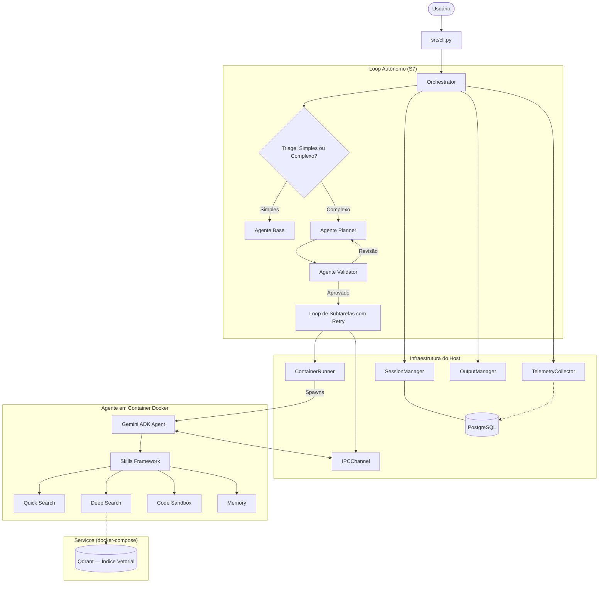

# 🔮 GeminiClaw

**GeminiClaw** é um framework de orquestração de agentes de IA projetado para rodar em hardware local de baixo recurso computacional (**Raspberry Pi 5**) utilizando o ecossistema do **Google Gemini (ADK)** e **Docker** para isolamento completo.

O projeto permite que múltiplos agentes especializados colaborem em tarefas complexas via um loop de **raciocínio autônomo**, garantindo segurança, persistência de estado e uso eficiente de recursos.

---

## 📋 Índice

- [Instalação e Modos](#-instalação-e-modos)
- [Arquitetura](#-arquitetura)
- [Componentes Principais](#componentes-principais)
- [Skills Framework](#-skills-framework)
- [Raciocínio e Planejamento](#-raciocínio-e-planejamento)
- [Loop Autônomo](#-loop-de-execução-autônoma)
- [Agentes Especializados](#-agentes-especializados)
- [Comunicação (IPC)](#-comunicação-ipc)
- [Infraestrutura Docker](#-infraestrutura-docker)
- [Como testar](#-como-testar)
- [Status do Desenvolvimento](#-status-do-desenvolvimento)

---

## 🚀 Instalação e Modos

O GeminiClaw pode ser configurado em diferentes modos dependendo do hardware disponível.

### 1. Modo Local (Recomendado para Pi 5)
Usa **Ollama** para inferência local e não requer internet para o LLM.
```bash
# Instalação
uv sync
cp .env.example .env

# Configuração .env
LLM_PROVIDER=ollama
LLM_MODEL=qwen3.5:4b
DEPLOYMENT_PROFILE=pi5
```

Veja o [guia de configuração do Ollama no Pi 5](OLLAMA_PI5.md) para detalhes de otimização e instalação.

### 2. Modo Cloud (Fallback)
Usa **Google Gemini API** para maior inteligência.
```bash
# Instalação
uv sync --extra google
cp .env.example .env

# Configuração .env
LLM_PROVIDER=google
LLM_MODEL=gemini-2.0-flash
GEMINI_API_KEY=sua_chave_aqui
```

---

## 🏗️ Arquitetura

O sistema utiliza uma abordagem de **Multi-Agent Systems (MAS)** onde um **Orchestrator** central coordena o planejamento e a execução, delegando tarefas para agentes que rodam em containers Docker isolados. Um **loop autônomo** decide se a tarefa é simples (resolvida pelo agente base diretamente) ou complexa (decomposta via Planner → Validator → execução sequencial).



### Componentes Principais

| Componente | Módulo | Função |
| --- | --- | --- |
| **Orchestrator** | `src/orchestrator.py` | Coordena o loop de planejamento e a execução sequencial de agentes. Integra o `AutonomousLoop`. Instrumentado com telemetria V5.6. |
| **AutonomousLoop** | `src/autonomous_loop.py` | Triage (simples/complexo), decomposição via Planner→Validator, loop de retentativas por subtarefa. Instrumentado com telemetria V5.8. |
| **ContainerRunner** | `src/runner.py` | Gerencia o ciclo de vida Docker (spawn, stop, limites de 512 MB RAM, `asyncio.Semaphore(3)`). |
| **IPCChannel** | `src/ipc.py` | Comunicação bidirecional via Unix Domain Sockets (Linux) ou TCP loopback (macOS). Protocolo JSON com length-prefix. |
| **SessionManager** | `src/session.py` | Persistência de histórico e estado em **PostgreSQL**. |
| **OutputManager** | `src/output_manager.py` | Gerencia artefatos produzidos e compartilhamento de arquivos entre agentes via `outputs/<session_id>/<task>/`. |
| **TelemetryCollector** | `src/telemetry.py` | Coleta e persiste métricas de execução (agent_events, tool_usage, token_usage, hardware_snapshots) em batch no PostgreSQL. |
| **SkillRegistry** | `src/skills/__init__.py` | Registro dinâmico que converte skills Python em ferramentas compatíveis com o Google ADK. |
| **CLI** | `src/cli.py` | Interface de linha de comando com modo direto, REPL interativo e subcomandos `--metrics`, `--export`. |

---

## 🛠️ Skills Framework

Localizado em `src/skills/`, este framework permite estender as capacidades dos agentes de forma modular. Cada skill implementa a interface `BaseSkill` e é automaticamente registrada no `SkillRegistry`, que as converte em ferramentas do ADK (`tools`).

```
src/skills/
├── __init__.py              # SkillRegistry + registro automático
├── base.py                  # BaseSkill (ABC) + SkillResult
├── search_quick/            # Busca rápida na web
│   ├── scraper.py           # DuckDuckGoScraper (httpx + BeautifulSoup)
│   ├── cache.py             # Cache em memória com TTL (SHA-256)
│   └── skill.py             # QuickSearchSkill
├── search_deep/             # Busca profunda em índice vetorial
│   ├── crawler.py           # DomainCrawler (robots.txt, rate limiting, chunking)
│   ├── indexer.py           # VectorIndexer (Qdrant, fastembed)
│   ├── indexer_cli.py       # CLI de administração do índice
│   ├── cache.py             # Cache de queries em PostgreSQL
│   └── skill.py             # DeepSearchSkill
├── code/                    # Execução de código Python
│   ├── sandbox.py           # PythonSandbox (container efêmero isolado)
│   └── skill.py             # CodeSkill (validação de segurança)
└── memory/                  # Memória de curto e longo prazo
    ├── short_term.py        # ShortTermMemory (in-process, por sessão)
    ├── long_term.py         # LongTermMemory (SQLite persistente)
    └── skill.py             # MemorySkill (remember, recall, memorize, retrieve)
```

### Skills disponíveis

| Skill | Nome ADK | Habilitação | Descrição |
| --- | --- | --- | --- |
| **Quick Search** | `quick_search` | `SKILL_QUICK_SEARCH_ENABLED=true` | Busca rápida na web via scraping do DuckDuckGo. Cache com TTL configurável. |
| **Deep Search** | `deep_search` | `SKILL_DEEP_SEARCH_ENABLED=false` | Busca profunda em base de conhecimento indexada localmente via Qdrant. Requer crawl prévio. |
| **Code** | `python_interpreter` | `SKILL_CODE_ENABLED=true` | Execução de código Python em container Docker efêmero e isolado (sem rede, 256 MB RAM). |
| **Memory** | `memory` | `SKILL_MEMORY_ENABLED=true` | Memória de curto prazo (por sessão, em RAM) e longo prazo (entre sessões, PostgreSQL). |

Cada skill pode ser habilitada/desabilitada individualmente via variáveis de ambiente. O agente base carrega apenas as skills ativas e injeta o contexto da memória de longo prazo na instrução do agente ao iniciar.

---

## 🧠 Raciocínio e Planejamento

O GeminiClaw implementa um ciclo de planejamento com validação iterativa:

1. **Triage**: O `AutonomousLoop` avalia se a tarefa é **simples** (resposta direta pelo agente base) ou **complexa** (requer decomposição).
2. **Decomposição**: O agente `Planner` recebe o prompt e cria um plano de ação (JSON) com múltiplos sub-agentes.
3. **Validação**: O agente `Validator` revisa o plano buscando falhas de lógica, segurança ou redundância.
4. **Iteração**: Se o plano for inconsistente, o `Validator` envia feedback ao `Planner` para revisão (até 3 tentativas).
5. **Execução**: Uma vez aprovado, o plano é executado sequencialmente com retry por subtarefa.

---

## 🔄 Loop de Execução Autônoma

Implementado em `src/autonomous_loop.py`, o loop gerencia tarefas complexas de ponta a ponta:

```
1. Triage: Planner decide se a tarefa é SIMPLE ou COMPLEX
2. Se SIMPLE → Agente Base resolve diretamente
3. Se COMPLEX:
   a. Planner decompõe a tarefa em subtarefas
   b. Validator aprova/rejeita o plano (até 3 iterações)
   c. Execução baseada em DAG (Grafo Direcionado Acíclico):
      - Todas as tarefas são agendadas em paralelo como corrotinas simultâneas.
      - Cada tarefa aguarda apenas a conclusão de suas próprias dependências (`depends_on`).
      - Em caso de falha de uma tarefa (após esgotar o retry), apenas as tarefas que dependem dela são canceladas. Tarefas independentes continuam rodando simultaneamente sem interrupção.
   d. Re-planejamento Automático:
      - Se ao final da execução do DAG houver falhas, os erros são consolidados e o ciclo retorna ao Planner para uma nova tentativa de plano (até MAX_PLAN_RETRIES).
      - Se o limite for atingido, o usuário é consultado ativamente.
   e. Ao final (em caso de sucesso), promove descobertas para memória de longo prazo
   f. Retorna resultado consolidado com artefatos
```

**Configurações:**
- `MAX_RETRY_PER_SUBTASK=3` — máximo de tentativas por subtarefa
- `MAX_SUBTASKS_PER_TASK=10` — limite de subtarefas por tarefa

---

## 🤖 Agentes Especializados

| Agente | Diretório | Imagem Docker | Responsabilidade |
| --- | --- | --- | --- |
| **Base** | `agents/base/` | `geminiclaw-base` | Tarefas genéricas. Integra todas as skills habilitadas e memória de longo prazo. |
| **Researcher** | `agents/researcher/` | `geminiclaw-researcher` | Pesquisa na web via Google Search ADK, extração de conteúdo e síntese. Cache de resultados integrado. |
| **Planner** | `agents/planner/` | `geminiclaw-planner` | Decomposição de problemas complexos em tarefas atômicas. Triage (simples/complexo). |
| **Validator** | `agents/validator/` | `geminiclaw-validator` | Verificação de segurança, formato JSON e consistência lógica de planos. |
| **Reviewer** | `agents/reviewer/` | `geminiclaw-reviewer` | Validação de resultados de subtarefas contra critérios definidos. |

Todos os agentes compartilham a mesma imagem Docker base (`containers/Dockerfile`) com variações para agentes especializados (`containers/Dockerfile.planner`, `containers/Dockerfile.researcher`, `containers/Dockerfile.validator`).

---

## 🔌 Comunicação (IPC)

A comunicação entre host e containers é baseada em **Unix Domain Sockets** (Linux) ou **TCP loopback** (macOS), com detecção automática de plataforma.

- **Protocolo**: Mensagens JSON com prefixo de tamanho (4 bytes big-endian) para integridade.
- **Reconexão**: Retry com backoff exponencial (até 3 tentativas) em caso de falha.
- **Segurança**: Containers sem acesso a rede externa (exceto via skills controladas) e rodando como `non-root` (`appuser`).
- **Limites**: Máximo de 3 agentes simultâneos (`asyncio.Semaphore(3)`) para preservar o Raspberry Pi 5.

---

## 🐳 Infraestrutura Docker

O projeto utiliza `docker-compose.yml` como ponto de entrada único para a infraestrutura:

```yaml
services:
  postgres:        # Banco relacional centralizado (PostgreSQL 16)
  qdrant:          # Banco vetorial para Deep Search
  geminiclaw:      # Processo principal (orquestrador + CLI)

volumes:
  postgres_data:   # Persistência do banco relacional
  qdrant_data:     # Persistência do índice vetorial

networks:
  geminiclaw-net:  # Rede interna isolada
```

Os agentes são containers **efêmeros** gerenciados pelo `ContainerRunner` — não fazem parte do Compose porque têm ciclo de vida dinâmico. Cada container de agente recebe:
- Acesso ao PostgreSQL via rede Docker (`geminiclaw-net`) — sem volumes de banco de dados locais
- Volume compartilhado para `/outputs` e `/logs`
- Limite de memória otimizado: **256 MB** para agentes leves (Planner/Validator) e **384 MB** para agentes pesados (Base/Researcher)
- Acesso à rede `geminiclaw-net` para comunicação com Qdrant e PostgreSQL
- Socket Docker do host (quando rodando dentro do container principal)

> **Nota sobre Limites de Memória**: As configurações de `mem_limit` (256m / 384m) foram otimizadas para o Raspberry Pi 5. Caso você possua um hardware mais robusto ou enfrente problemas de OOM (Out Of Memory) durante a execução de skills complexas, você pode alterar essas configurações diretamente no arquivo `src/runner.py`.

### Comandos

```bash
# Subir infraestrutura
docker compose up -d

# Verificar status
docker compose ps

# Reconstruir após mudanças
docker compose up -d --build geminiclaw

# Encerrar preservando volumes
docker compose down
```

---

## 🚀 Como testar

```bash
# Criar ambiente virtual
uv venv .venv && source .venv/bin/activate

# Instalar apenas dependências locais (Pi 5 / Ollama)
uv sync

# Instalar com suporte a Google Gemini
uv sync --extra google

# Instalar tudo (Deep Search + Google)
uv sync --all-extras

# Após clonar o projeto ou modificar Dockerfiles, construa as imagens localmente:
./scripts/build_images.sh

# Rodar todos os testes unitários
uv run pytest -m unit -v

# Rodar testes unitários + integração
uv run pytest -m "unit or integration" -v

# Rodar com cobertura
uv run pytest --cov=src --cov=agents --cov-report=term-missing
```

---

## 📊 Status do Desenvolvimento

O desenvolvimento é guiado pelos roadmaps em `roadmaps/`, que definem as etapas de implementação das skills, capacidades autônomas e infraestrutura de observabilidade.

### Roadmaps de Features

| Etapa | Descrição | Status |
| --- | --- | --- |
| **SI** | Infraestrutura com docker-compose | ✅ Concluída |
| **S0** | Interface base de skills (`BaseSkill`, `SkillRegistry`) | ✅ Concluída |
| **S1** | Skill de busca rápida (DuckDuckGo + cache) | ✅ Concluída |
| **S2** | Skill de busca profunda (crawler + Qdrant) | ✅ Concluída |
| **S3** | Skill de execução de código (sandbox Docker) | ✅ Concluída |
| **S4** | Memória de curto prazo (in-process) | ✅ Concluída |
| **S5** | Memória de longo prazo (Qdrant + PostgreSQL) | ✅ Concluída |
| **S6** | Integração das skills ao agente base | ✅ Concluída |
| **S7** | Loop de execução autônoma | ✅ Concluída |
| **S8** | Validação integrada em cenário real | 🔄 Em progresso |

### Roadmaps de Infraestrutura

| Roadmap | Descrição | Status |
| --- | --- | --- |
| **V8** | Migração SQLite → PostgreSQL (pool `psycopg` v3, `docker-compose`) | ✅ Concluída |
| **V9** | Abstração de provedores LLM (Ollama + Google Gemini) | ✅ Concluída |
| **V5** | Framework de Observabilidade e Métricas | ✅ Concluída |

#### V5 — Observabilidade (concluído)

- **Schema PostgreSQL**: quatro tabelas de telemetria (`agent_events`, `tool_usage`, `token_usage`, `hardware_snapshots`)
- **`TelemetryCollector`** (`src/telemetry.py`): singleton com buffer de 50 eventos e flush assíncrono no PostgreSQL
- **Instrumentação de módulos core**: `orchestrator.py` (spawn/IPC/complete/error), `agent_loop.py` (token usage, tool usage), `autonomous_loop.py` (triage, plan, subtask, replan, memory promotion)
- **Hardware Snapshots**: integração com `PiHealthMonitor` após cada subtarefa
- **Queries de análise**: timeline, token summary, tool summary, hardware peaks, métricas derivadas
- **CLI**: `geminiclaw --metrics <id>` e `--export <id>` para exportação em CSV
- **Testes**: 350 testes unitários passando (incluindo 24 testes específicos de telemetria)

```bash
# Ver métricas de uma execução
uv run python -m src.cli --metrics <execution_id>

# Exportar métricas para CSV
uv run python scripts/export_metrics.py <execution_id>

# Listar execuções recentes
uv run python scripts/export_metrics.py --list
```

---

## 📁 Estrutura do Projeto

```
geminiclaw/
├── AGENTS.md                  # Regras e contexto para agentes de IA
├── README.md                  # Este arquivo
├── pyproject.toml             # Dependências e configuração (uv)
├── docker-compose.yml         # Infraestrutura de serviços (PostgreSQL + Qdrant)
├── scripts/
│   ├── init_db.sql            # Schema PostgreSQL (idempotente)
│   └── export_metrics.py      # Exporta métricas de telemetria para CSV
├── src/                       # Orquestrador Python
│   ├── cli.py                 # CLI (REPL + --metrics + --export)
│   ├── orchestrator.py        # Orquestrador principal (instrumentado V5.6)
│   ├── autonomous_loop.py     # Loop de execução autônoma S7 (instrumentado V5.8)
│   ├── runner.py              # ContainerRunner (Docker)
│   ├── ipc.py                 # IPCChannel (Unix Sockets / TCP)
│   ├── session.py             # SessionManager (PostgreSQL)
│   ├── db.py                  # Pool singleton PostgreSQL (psycopg v3)
│   ├── telemetry.py           # TelemetryCollector V5 (buffer + flush + queries)
│   ├── history.py             # Histórico de execuções
│   ├── health.py              # PiHealthMonitor (temperatura, CPU, RAM)
│   ├── output_manager.py      # Gerenciamento de artefatos
│   ├── config.py              # Configuração centralizada
│   ├── logger.py              # Logger estruturado JSON
│   ├── llm/                   # Abstração LLM (Ollama + Google)
│   │   ├── agent_loop.py      # Loop ReAct do agente (instrumentado V5.7)
│   │   ├── factory.py         # Factory de provedores LLM
│   │   └── providers/         # Ollama + Google Gemini
│   └── skills/                # Framework de skills (S0–S5)
├── agents/                    # Agentes ADK
│   ├── base/                  # Agente base (integra skills)
│   ├── planner/               # Agente de planejamento
│   ├── researcher/            # Agente de pesquisa
│   └── validator/             # Agente de validação
├── containers/                # Dockerfiles
├── tests/                     # Testes pytest (unit, integration, e2e)
├── roadmaps/                  # Roadmaps de desenvolvimento
├── outputs/                   # Artefatos dos agentes (runtime)
└── logs/                      # Logs estruturados (runtime)
```

---

## 📄 Licença

Este projeto está licenciado sob os termos do arquivo [LICENSE](LICENSE).
