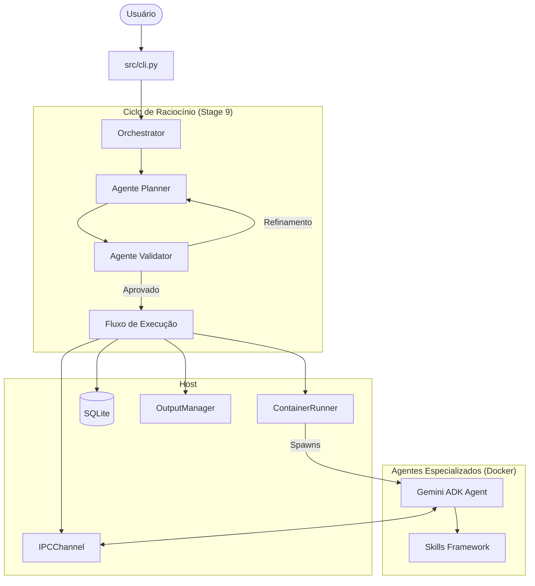

# 🔮 GeminiClaw

**GeminiClaw** é um framework de orquestração de agentes de IA projetado para rodar em hardware local (**Raspberry Pi 5**) utilizando o ecossistema do **Google Gemini (ADK)** e **Docker** para isolamento completo.

O projeto permite que múltiplos agentes especializados colaborem em tarefas complexas via um loop de **raciocínio e planejamento**, garantindo segurança, persistência de estado e uso eficiente de recursos.

---

## 🏗️ Arquitetura

O sistema utiliza uma abordagem de **Multi-Agent Systems (MAS)** onde um **Orchestrator** central coordena o planejamento e a execução.



### Componentes Principais

| Componente | Função |
| --- | --- |
| **Orchestrator** | Coordena o loop de planejamento e a execução sequencial de agentes. |
| **ContainerRunner** | Gerencia o ciclo de vida do Docker (spawn, stop, limites de 512MB RAM). |
| **IPCChannel** | Comunicação bidirecional segura via Unix Domain Sockets. |
| **SessionManager** | Persistência de histórico e estado em SQLite. |
| **OutputManager** | Gerencia artefatos e compartilhamento de arquivos entre agentes. |
| **Skills Framework** | Extensibilidade para ferramentas (Busca, Execução de código, etc). |

---

## 🧠 Raciocínio e Planejamento

Diferente de sistemas lineares, o GeminiClaw implementa um loop de planejamento (Stage 9):

1. **Decomposição**: O agente `Planner` recebe o prompt e cria um plano de ação (JSON) com múltiplos sub-agentes.
2. **Validação**: O agente `Validator` revisa o plano buscando falhas de lógica, segurança ou redundância.
3. **Iteração**: Se o plano for inconsistente, o `Validator` envia feedback ao `Planner` para revisão (até 3 tentativas).
4. **Execução**: Uma vez aprovado, o plano é executado sequencialmente, com estado compartilhado via diretórios de output do Host.

---

## 🤖 Agentes Especializados

| Agente | Especialidade | Capacidades |
| --- | --- | --- |
| **Base** | Tarefas genéricas | Processamento de texto e raciocínio padrão. |
| **Researcher** | Pesquisa Web | Google Search ADK, extração de conteúdo e síntese. |
| **Planner** | Estratégia | Decomposição de problemas complexos em tarefas atômicas. |
| **Validator** | Qualidade | Verificação de segurança, formato JSON e consistência lógica. |

---

## 🛠️ Skills Framework

Localizado em `src/skills/`, este framework permite estender as capacidades dos agentes de forma modular:

- **BaseSkill**: Interface abstrata para criação de novas ferramentas.
- **SkillRegistry**: Registro dinâmico que converte skills Python em ferramentas compatíveis com o Google ADK.
- **Isolamento**: Skills podem acessar arquivos de saída da sessão para processamento multi-agente.

---

## 🔌 Comunicação (IPC)

A comunicação é baseada em **Unix Domain Sockets** montados via volume, garantindo que o tráfego não saia do Host.

- **Protocolo**: Mensagens JSON com prefixo de tamanho para integridade.
- **Segurança**: Containers sem acesso a rede externa (exceto via ferramentas controladas) e rodando como `non-root`.
- **Limites**: Máximo de 3 agentes simultâneos para preservar o Raspberry Pi 5.

---

## 🚀 Como testar

```bash
# Rodar suite completa de testes
uv run pytest -m "unit or integration" -v
```

Consulte o [roadmap_v2.md](roadmaps/roadmap_v2.md) para ver o status do desenvolvimento ou as diretrizes em `.agents/rules/`.
