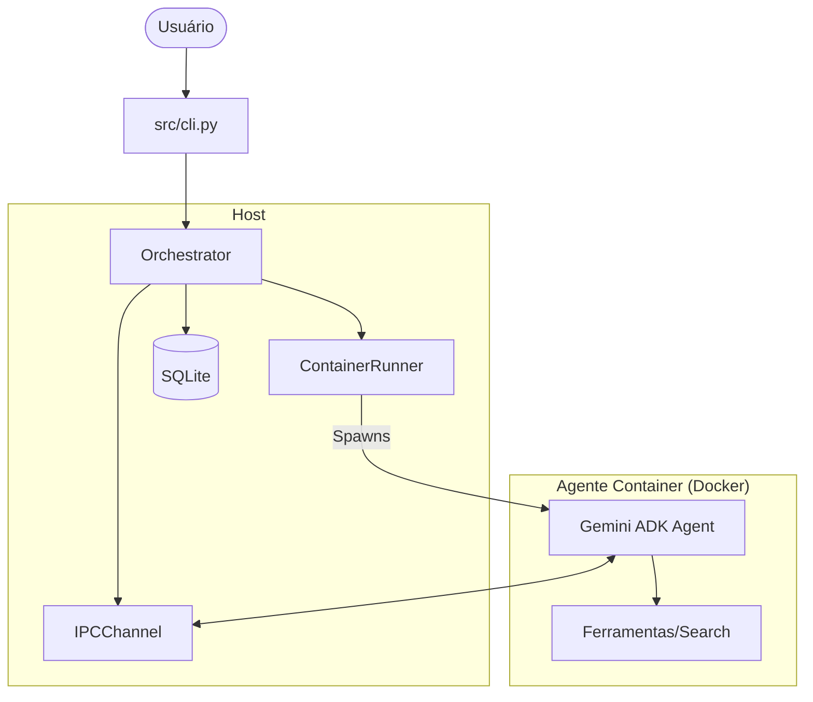

# 🔮 GeminiClaw

**GeminiClaw** é um framework de orquestração de agentes de IA projetado para rodar em hardware local (**Raspberry Pi 5**) utilizando o ecossistema do **Google Gemini (ADK)** e **Docker** para isolamento completo.

O projeto permite que múltiplos agentes especializados colaborem em tarefas complexas, garantindo segurança, persistência de estado e controle rigoroso de recursos.

---

## 🏗️ Arquitetura

O sistema é dividido entre um **Host (Orquestrador)** e diversos **Agentes (Containers)**. O Host coordena o ciclo de vida, enquanto os agentes executam a lógica especializada.



### Component Principal

| Componente | Função |
| --- | --- |
| **Orchestrator** | Cérebro do sistema. Decide quais agentes usar e coordena o fluxo de mensagens. |
| **ContainerRunner** | Gerencia o ciclo de vida do Docker (spawn, stop, limits, network). |
| **IPCChannel** | Canal de comunicação bidirecional via Unix Domain Sockets. |
| **SessionManager** | Persiste o estado e histórico das interações em SQLite. |
| **Agents** | Implementações baseadas no Google ADK rodando em imagens Python isoladas. |

---

## 🔄 Orquestração pelo Host

O Host gerencia cada agente seguindo um ciclo de vida rigoroso para garantir que recursos no Raspberry Pi (como memória e CPU) sejam preservados:

1. **Decisão**: O orquestrador analisa o prompt e define as tarefas dos agentes.
2. **Sessão**: Cria uma entrada no banco de dados SQLite para rastrear o estado.
3. **Container**: O `ContainerRunner` inicia uma imagem Docker com limites de 512MB e 1 CPU.
4. **IPC**: Abre um socket Unix exclusivo para aquele par Host ↔ Agente.
5. **Comunicação**: Envia a "Request" (prompt) e aguarda a "Response" (resultado).
6. **Cleanup**: Após a resposta ou timeout, o container é destruído e o socket removido.

---

## 🔌 Comunicação (IPC)

A comunicação não acontece via rede (HTTP/gRPC), mas através de **Unix Domain Sockets** montados como volumes nos containers. Isso garante latência mínima e segurança (isolamento de rede).

### Protocolo de Mensagens

As mensagens são enviadas em formato JSON com prefixo de tamanho (length-prefix) para garantir integridade:

```json
{
    "type": "request|response|error",
    "session_id": "uuid-da-sessao",
    "payload": {
        "prompt": "...",
        "answer": "..."
    },
    "timestamp": "ISO-8601"
}
```

### Segurança e Isolamento

- **Rede**: Containers rodam em uma ponte Docker isolada (`geminiclaw-net`) sem acesso externo, exceto via IPC.
- **Usuário**: Processos dentro do container rodam como `appuser` (não-root).
- **Recursos**: `asyncio.Semaphore(3)` limita o máximo de 3 agentes simultâneos para evitar travamentos do Pi 5.

---

## 🚀 Como testar

```bash
# Rodar suite completa de testes
uv run pytest -m "unit or integration" -v
```

Consulte o [roadmap.md](roadmap.md) para ver o status do desenvolvimento ou os arquivos em `.agents/rules/` para diretrizes técnicas.
