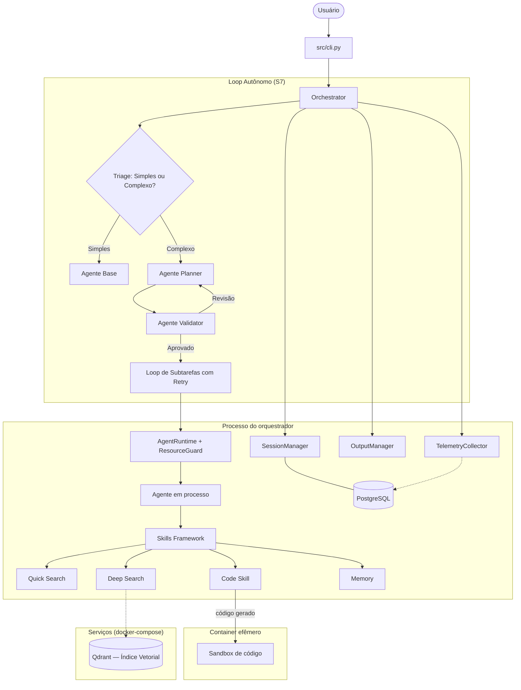

# 🔮 GeminiClaw

**GeminiClaw** é um framework de orquestração de agentes de IA projetado para rodar em hardware local de baixo recurso computacional (**Raspberry Pi 5**) com provedores LLM agnósticos (**Google Gemini**, **Anthropic Claude**, **OpenAI** e **Ollama** local) e **Docker** apenas para isolar a execução de código.

O projeto permite que múltiplos agentes especializados colaborem em tarefas complexas via um loop de **raciocínio autônomo**, garantindo segurança, persistência de estado e uso eficiente de recursos.

---

## 📋 Índice

- [Instalação e Modos](#-instalação-e-modos)
- [Arquitetura](#-arquitetura)
- [Componentes Principais](#componentes-principais)
- [Skills Framework](#-skills-framework)
- [Raciocínio e Planejamento](#-raciocínio-e-planejamento)
- [Loop Autônomo](#-loop-de-execução-autônoma)
- [Agentes Especializados](#-agentes-especializados)
- [Comunicação (IPC)](#-comunicação-ipc)
- [Infraestrutura Docker](#-infraestrutura-docker)
- [Como testar](#-como-testar)
- [Status do Desenvolvimento](#-status-do-desenvolvimento)

---

## 🚀 Instalação e Modos

O GeminiClaw pode ser configurado em diferentes modos dependendo do hardware disponível.

### 1. Modo Local (Recomendado para Pi 5)
Usa **Ollama** para inferência local e não requer internet para o LLM.
```bash
# Instalação
uv sync
cp .env.example .env

# Configuração .env (política padrão: self_hosted_only; o catálogo escolhe o modelo Ollama)
LLM_DATA_POLICY=self_hosted_only
RESEARCHER_MODEL=ollama/qwen3.5:4b   # opcional: pin provedor/modelo
DEPLOYMENT_PROFILE=pi5
```

Veja o [guia de configuração do Ollama no Pi 5](OLLAMA_PI5.md) para detalhes de otimização e instalação.

### 2. Modo Cloud (Fallback)
Usa **Google Gemini API** para maior inteligência.
```bash
# Instalação
uv sync --extra google
cp .env.example .env

# Configuração .env (prompts com dados do projeto saem do host: declare a política explicitamente)
LLM_DATA_POLICY=third_party_allowed
GEMINI_API_KEY=sua_chave_aqui
```

---

## 🏗️ Arquitetura

O sistema utiliza uma abordagem de **Multi-Agent Systems (MAS)** onde um **Orchestrator** central coordena o planejamento e a execução, delegando tarefas para agentes que rodam **no próprio processo do orquestrador** (`AgentRuntime`, ADR 014). O único container de execução é o **sandbox de código**, usado pela skill de código para rodar o que o LLM gera. Um **loop autônomo** decide se a tarefa é simples (resolvida pelo agente base diretamente) ou complexa (decomposta via Planner → Validator → execução sequencial).


```mermaid
graph TD
    User([Usuário]) --> CLI[src/cli.py]
    CLI --> Orch[Orchestrator]
    
    subgraph "Loop Autônomo (S7)"
        Orch --> Triage{Triage: Simples ou Complexo?}
        Triage -- Simples --> BaseAgent[Agente Base]
        Triage -- Complexo --> Planner[Agente Planner]
        Planner --> Validator[Agente Validator]
        Validator -- Revisão --> Planner
        Validator -- Aprovado --> ExecLoop[Loop de Subtarefas com Retry]
    end

    subgraph "Processo do orquestrador"
        ExecLoop --> RT[AgentRuntime + ResourceGuard]
        Orch --> SM[SessionManager]
        Orch --> OM[OutputManager]
        SM --- DB[(PostgreSQL)]
        Orch --> TEL[TelemetryCollector]
        TEL -.-> DB
        RT --> Agent[Agente em processo]
        Agent --> Skills[Skills Framework]
        Skills --> QS[Quick Search]
        Skills --> DS[Deep Search]
        Skills --> CS[Code Skill]
        Skills --> Mem[Memory]
    end

    subgraph "Container efêmero"
        CS -- código gerado --> Sandbox[Sandbox de código]
    end

    subgraph "Serviços (docker-compose)"
        Qdrant[(Qdrant — Índice Vetorial)]
        DS -.-> Qdrant
    end
```

### Componentes Principais

| Componente | Módulo | Função |
| --- | --- | --- |
| **Orchestrator** | `src/orchestrator.py` | Coordena o loop de planejamento e a execução sequencial de agentes. Integra o `AutonomousLoop`. Instrumentado com telemetria V5.6. |
| **AutonomousLoop** | `src/autonomous_loop.py` | Triage (simples/complexo), decomposição via Planner→Validator, loop de retentativas por subtarefa. Instrumentado com telemetria V5.8. |
| **AgentRuntime** | `src/agent_runtime/runtime.py` | Executa cada agente no processo do orquestrador, com contexto por tarefa (`contextvars`), timeout (`AGENT_TIMEOUT_SECONDS`) e isolamento de falhas: uma exceção vira `AgentResult` de erro e nunca derruba a sessão. |
| **ResourceGuard** | `src/agent_runtime/resources.py` | Limita quantos agentes rodam ao mesmo tempo (pela RAM livre, teto `MAX_CONCURRENT_AGENTS`), reserva uma vaga extra para inferência local (`MAX_LOCAL_LLM_CONCURRENT`) e espera a temperatura e a memória do Pi voltarem ao normal. |
| **Infraestrutura** | `src/infrastructure.py` | Na partida, confere se PostgreSQL, Qdrant e o daemon de containers (só para o sandbox) respondem. |
| **SessionManager** | `src/session.py` | Persistência de histórico e estado em **PostgreSQL**. |
| **OutputManager** | `src/output_manager.py` | Gerencia artefatos produzidos e compartilhamento de arquivos entre agentes via `outputs/<session_id>/<task>/`. |
| **TelemetryCollector** | `src/telemetry.py` | Coleta e persiste métricas de execução (agent_events, tool_usage, token_usage, hardware_snapshots) em batch no PostgreSQL. Fornece estatísticas sintetizadas para o Summarizer. |
| **SkillRegistry** | `src/skills/__init__.py` | Registro dinâmico que converte skills Python em ferramentas compatíveis com o formato de tool calling dos provedores LLM. |
| **CLI** | `src/cli.py` | Interface de linha de comando com modo direto, REPL interativo e subcomandos `--metrics`, `--export`. |

---

## 🛠️ Skills Framework

Localizado em `src/skills/`, este framework permite estender as capacidades dos agentes de forma modular. Cada skill implementa a interface `BaseSkill` e é automaticamente registrada no `SkillRegistry`, que as converte em ferramentas (`tools`) no formato de tool calling dos provedores.

```
src/skills/
├── __init__.py              # SkillRegistry + registro automático
├── base.py                  # BaseSkill (ABC) + SkillResult
├── search_quick/            # Busca rápida na web
│   ├── scraper.py           # DuckDuckGoScraper (httpx + BeautifulSoup)
│   ├── cache.py             # Cache em memória com TTL (SHA-256)
│   └── skill.py             # QuickSearchSkill
├── search_deep/             # Busca profunda em índice vetorial
│   ├── crawler.py           # DomainCrawler (robots.txt, rate limiting, chunking)
│   ├── indexer.py           # VectorIndexer (Qdrant, fastembed)
│   ├── indexer_cli.py       # CLI de administração do índice
│   ├── cache.py             # Cache de queries em PostgreSQL
│   └── skill.py             # DeepSearchSkill
├── code/                    # Execução de código Python
│   ├── sandbox.py           # PythonSandbox (container efêmero isolado)
│   └── skill.py             # CodeSkill (validação de segurança)
└── memory/                  # Memória de curto e longo prazo
    ├── short_term.py        # ShortTermMemory (in-process, por sessão)
    ├── long_term.py         # LongTermMemory (SQLite persistente)
    └── skill.py             # MemorySkill (remember, recall, memorize, retrieve)
```

### Skills disponíveis

| Skill | Nome da ferramenta | Habilitação | Descrição |
| --- | --- | --- | --- |
| **Quick Search** | `quick_search` | `SKILL_QUICK_SEARCH_ENABLED=true` | Busca rápida na web via scraping do DuckDuckGo. Cache com TTL configurável. |
| **Deep Search** | `deep_search` | `SKILL_DEEP_SEARCH_ENABLED=false` | Busca profunda em base de conhecimento indexada localmente via Qdrant. Requer crawl prévio. |
| **Document Processor** | `document_processor` | `SKILL_DOCUMENT_PROCESSOR_ENABLED=false` | Ingestão, chunking e indexação (Qdrant + Postgres) de arquivos do usuário (PDF, CSV, TXT, DOCX, XLSX). |
| **Code** | `python_interpreter` | `SKILL_CODE_ENABLED=true` | Execução de código Python em container Docker efêmero e isolado (sem rede, 256 MB RAM). |
| **Memory** | `memory` | `SKILL_MEMORY_ENABLED=true` | Memória de curto prazo (por sessão, em RAM) e longo prazo (entre sessões, PostgreSQL). |
| **Web Reader** | `web_reader` | `SKILL_WEB_READER_ENABLED=true` | Leitura de conteúdo completo de URLs (apenas `http://` e `https://`). Valida robots.txt (RFC 9309). Sempre use após `quick_search`. |

Cada skill pode ser habilitada/desabilitada individualmente via variáveis de ambiente. O agente base carrega apenas as skills ativas e injeta o contexto da memória de longo prazo na instrução do agente ao iniciar.

---

## 🧠 Raciocínio e Planejamento

O GeminiClaw implementa um ciclo de planejamento com validação iterativa:

1. **Triage**: O `AutonomousLoop` avalia se a tarefa é **simples** (resposta direta pelo agente base) ou **complexa** (requer decomposição).
2. **Decomposição**: O agente `Planner` recebe o prompt e cria um plano de ação (JSON) com múltiplos sub-agentes.
3. **Validação**: O agente `Validator` revisa o plano buscando falhas de lógica, segurança ou redundância.
4. **Iteração**: Se o plano for inconsistente, o `Validator` envia feedback ao `Planner` para revisão (até 3 tentativas).
5. **Execução**: Uma vez aprovado, o plano é executado sequencialmente com retry por subtarefa.

---

## 🔄 Loop de Execução Autônoma

Implementado em `src/autonomous_loop.py`, o loop gerencia tarefas complexas de ponta a ponta:

```
1. Triage: Planner decide se a tarefa é SIMPLE ou COMPLEX
2. Se SIMPLE → Agente Base resolve diretamente
3. Se COMPLEX:
   a. Planner decompõe a tarefa em subtarefas
   b. Validator aprova/rejeita o plano (até 3 iterações)
   c. Execução baseada em DAG (Grafo Direcionado Acíclico):
      - Todas as tarefas são agendadas em paralelo como corrotinas simultâneas.
      - Cada tarefa aguarda apenas a conclusão de suas próprias dependências (`depends_on`).
      - Em caso de falha de uma tarefa (após esgotar o retry), apenas as tarefas que dependem dela são canceladas. Tarefas independentes continuam rodando simultaneamente sem interrupção.
   d. Re-planejamento Automático:
      - Se ao final da execução do DAG houver falhas, os erros são consolidados e o ciclo retorna ao Planner para uma nova tentativa de plano (até MAX_PLAN_RETRIES).
      - Se o limite for atingido, o usuário é consultado ativamente.
    e. Ao final (em caso de sucesso), promove descobertas para memória de longo prazo
    f. Etapa de Síntese Final: o Agente Summarizer é invocado para consolidar todos os resultados e estatísticas de telemetria em um relatório acadêmico final.
    g. Retorna resultado consolidado com artefatos
```

**Configurações:**
- `MAX_RETRY_PER_SUBTASK=3` — máximo de tentativas por subtarefa
- `MAX_SUBTASKS_PER_TASK=10` — limite de subtarefas por tarefa
- `MAX_PLAN_RETRIES=5` — ciclos máximos de replanejamento (V12.1)
- `MAX_AGENT_RUNS_PER_SESSION=30` — limite de execuções de agente por sessão; interrompe a execução ao atingir (circuit breaker V12.5)

**Circuit Breakers (V12.5):**
- **Progresso zero**: Se dois ciclos de replanejamento consecutivos produzirem o mesmo conjunto de subtarefas bem-sucedidas, o loop é interrompido com mensagem diagnóstica.
- **Limite de execuções**: Se o número de agentes executados em uma sessão atingir `MAX_AGENT_RUNS_PER_SESSION`, o orquestrador lança `RuntimeError` antes da execução seguinte.

---

## 🤖 Agentes Especializados

| Agente | Diretório | Responsabilidade |
| --- | --- | --- |
| **Base** | `agents/base/` | Tarefas genéricas. Integra todas as skills habilitadas e memória de longo prazo. |
| **Researcher** | `agents/researcher/` | Pesquisa na web via busca rápida, extração de conteúdo e síntese. Cache de resultados integrado. |
| **Planner** | `agents/planner/` | Decomposição de problemas complexos em tarefas atômicas. Triage (simples/complexo). |
| **Validator** | `agents/validator/` | Verificação de segurança, formato JSON e consistência lógica de planos. |
| **Reviewer** | `agents/reviewer/` | Validação de resultados de subtarefas contra critérios definidos. |
| **Summarizer** | `agents/summarizer/` | Síntese final de resultados com rastreabilidade acadêmica e metadados de autonomia. |

Os agentes rodam no processo do orquestrador. O roteador de modelos (ADR 017) resolve o provedor e o modelo de cada papel uma vez por sessão, a partir do catálogo `src/llm/catalog.yaml`, da política `LLM_DATA_POLICY` e da disponibilidade dos provedores; `{PAPEL}_MODEL=provedor/modelo` (por exemplo, `RESEARCHER_MODEL=anthropic/claude-sonnet-5-5`) fixa o modelo de um papel, o que permite misturar provedores na mesma sessão.

---

## ⚙️ Execução dos Agentes

Não há canal de comunicação entre processos: o orquestrador chama o agente diretamente.

- **Contexto por tarefa**: cada execução recebe um `AgentContext` (sessão, papel, diretório de saída, modelo) via `contextvars`, o que isola tarefas concorrentes sem usar variáveis de ambiente.
- **Supervisão**: timeout por agente e captura de exceções; falha, timeout e cancelamento têm tratamento distinto.
- **Recursos**: o `ResourceGuard` limita agentes simultâneos e aguarda o Pi esfriar ou liberar memória antes de iniciar outro.
- **Perguntas ao pesquisador**: a ferramenta `ask_researcher` chama diretamente o orquestrador (deduplicação e registro na sessão).
- **Código gerado**: nunca roda no host. A skill de código o envia ao sandbox, um container efêmero que devolve os artefatos ao diretório da sessão.

---

## 🐳 Infraestrutura Docker

O `docker-compose.yml` sobe apenas os **serviços de apoio**; o orquestrador e os agentes rodam como processo local (`uv run geminiclaw ...`):

```yaml
services:
  postgres:        # Banco relacional e grafo (PostgreSQL 16 + Apache AGE)
  qdrant:          # Banco vetorial para Deep Search
  ollama:          # Opcional (perfil local-llm)

volumes:
  postgres_data:   # Persistência do banco relacional
  qdrant_data:     # Persistência do índice vetorial
```

> **Qdrant no Raspberry Pi 5**: o serviço usa a imagem oficial `qdrant/qdrant` (versão fixada no compose; troque com `QDRANT_IMAGE` no `.env`), sem compilar no Pi. Validada a **v1.19.1** no kernel padrão do Pi 5 (páginas de 16K); versões antigas tiveram falha `<jemalloc>: Unsupported system page size` ([qdrant#5952](https://github.com/qdrant/qdrant/issues/5952)), então teste no Pi antes de trocar a versão.

> **Portas abertas em desenvolvimento**: o Qdrant fica publicado em `0.0.0.0` (sem autenticação) para facilitar o acesso pela rede. Há um `TODO` no `docker-compose.yml` para fechar as portas em `127.0.0.1` antes de sair do ambiente de desenvolvimento.

### Sandbox de código

O único container de execução é o **sandbox**, criado sob demanda pela skill de código (`src/skills/code/sandbox.py`) a partir da imagem `SANDBOX_IMAGE` (padrão `code-sandbox:latest`, construída por `bash scripts/build_images.sh` a partir de `containers/sandbox/Dockerfile`). A imagem é mínima (Python, `uv` e o conjunto científico básico); pacotes extras pedidos em `packages` são instalados sem root em `/deps` e o script roda sem rede (ADR 018). O container roda sem privilégios (UID do orquestrador, sem capacidades, raiz somente leitura), com limites de memória, CPU e processos; os artefatos voltam pela pasta da subtarefa montada em `/outputs`, e o container é removido ao fim.

```bash
# Construir a imagem do sandbox (ARM64 / Raspberry Pi 5)
bash scripts/build_images.sh

# Listar e encerrar sandboxes ativos
geminiclaw sessions
geminiclaw stop
```

### Comandos

```bash
# Subir os serviços de apoio
docker compose up -d

# Verificar status
docker compose ps

# Encerrar preservando volumes
docker compose down
```

---

## 🚀 Como testar

```bash
# Criar ambiente virtual
uv venv .venv && source .venv/bin/activate

# Instalar apenas dependências locais (Pi 5 / Ollama)
uv sync

# Instalar com suporte a Google Gemini
uv sync --extra google

# Instalar tudo (Deep Search + Google)
uv sync --all-extras

# Após clonar o projeto ou modificar o Dockerfile do sandbox, construa a imagem localmente:
./scripts/build_images.sh

# Rodar todos os testes unitários
uv run pytest -m unit -v

# Rodar testes unitários + integração
uv run pytest -m "unit or integration" -v

# Rodar com cobertura
uv run pytest --cov=src --cov=agents --cov-report=term-missing
```

---

## 📊 Status do Desenvolvimento

O desenvolvimento é guiado pelos roadmaps em `roadmaps/`, que definem as etapas de implementação das skills, capacidades autônomas e infraestrutura de observabilidade.

### Roadmaps de Features

| Etapa | Descrição | Status |
| --- | --- | --- |
| **SI** | Infraestrutura com docker-compose | ✅ Concluída |
| **S0** | Interface base de skills (`BaseSkill`, `SkillRegistry`) | ✅ Concluída |
| **S1** | Skill de busca rápida (DuckDuckGo + cache) | ✅ Concluída |
| **S2** | Skill de busca profunda (crawler + Qdrant) | ✅ Concluída |
| **S3** | Skill de execução de código (sandbox Docker) | ✅ Concluída |
| **S4** | Memória de curto prazo (in-process) | ✅ Concluída |
| **S5** | Memória de longo prazo (Qdrant + PostgreSQL) | ✅ Concluída |
| **S6** | Integração das skills ao agente base | ✅ Concluída |
| **V7** | Processamento de Documentos e Ingestão (Docling + Fallbacks) | ✅ Concluída |
| **S7** | Loop de execução autônoma | ✅ Concluída |
| **V6** | Pesquisa Autônoma e Controle de Concorrência | 🔄 Em progresso |
| **S8** | Validação integrada em cenário real | 🔄 Em progresso |

### Roadmaps de Infraestrutura

| Roadmap | Descrição | Status |
| --- | --- | --- |
| **V8** | Migração SQLite → PostgreSQL (pool `psycopg` v3, `docker-compose`) | ✅ Concluída |
| **V9** | Abstração de provedores LLM (Ollama + Google Gemini) | ✅ Concluída |
| **V5** | Framework de Observabilidade e Métricas | ✅ Concluída |
| **V11** | Estabilização do Pipeline de Telemetria | ✅ Concluída |
| **V12** | Resiliência e Observabilidade Avançada | ✅ Concluída |

#### V12 — Resiliência e Observabilidade (concluído)

- **V12.1 (Cache Poisoning Fix)**: Cache-busting por injeção de contexto de erro — garante que o agente receba prompts distintos a cada retry, evitando respostas cacheadas repetitivas.
- **V12.2 (Agent Loop Resilience)**: `ErrorTracker` com detecção de loops de erro repetitivos, remoção dinâmica de ferramentas com falha sistemática e detecção de respostas declarativas sem ação.
- **V12.3 (Telemetria Cross-Container)**: Canal IPC de fallback via `drain_buffer()` + `_ingest_container_telemetry()`. Garante persistência de `token_usage`/`tool_usage` mesmo em containers sem acesso direto ao PostgreSQL. `retry_attempt` propagado para `subtask_metrics`.
- **V12.4 (WebReader)**: Validação de schema de URL (rejeita `file://`, `ftp://` etc.). Correção de robots.txt 404 (RFC 9309). Diretiva search-first nos prompts dos agentes `base` e `researcher`.
- **V12.5 (Circuit Breaker)**: Detecção de progresso zero entre ciclos de replanejamento (`hash(frozenset(succeeded_tasks))`). Limite de containers por sessão (`MAX_CONTAINERS_PER_SESSION`).


#### V5 — Observabilidade (concluído)

- **Schema PostgreSQL**: quatro tabelas de telemetria (`agent_events`, `tool_usage`, `token_usage`, `hardware_snapshots`)
- **`TelemetryCollector`** (`src/telemetry.py`): singleton com buffer de 50 eventos e flush assíncrono no PostgreSQL
- **Instrumentação de módulos core**: `orchestrator.py` (spawn/IPC/complete/error), `agent_loop.py` (token usage, tool usage), `autonomous_loop.py` (triage, plan, subtask, replan, memory promotion)
- **Hardware Snapshots**: integração com `PiHealthMonitor` após cada subtarefa
- **Queries de análise**: timeline, token summary, tool summary, hardware peaks, métricas derivadas
- **CLI**: `geminiclaw --metrics <id>` e `--export <id>` para exportação em CSV
- **Testes**: 350 testes unitários passando (incluindo 24 testes específicos de telemetria)

```bash
# Ver métricas de uma execução
uv run python -m src.cli --metrics <execution_id>

# Exportar métricas para CSV
uv run python scripts/export_metrics.py <execution_id>

# Listar execuções recentes
uv run python scripts/export_metrics.py --list
```

---

## 📁 Estrutura do Projeto

```
geminiclaw/
├── AGENTS.md                  # Regras e contexto para agentes de IA
├── README.md                  # Este arquivo
├── pyproject.toml             # Dependências e configuração (uv)
├── docker-compose.yml         # Infraestrutura de serviços (PostgreSQL + Qdrant)
├── scripts/
│   ├── init_db.sql            # Schema PostgreSQL (idempotente)
│   └── export_metrics.py      # Exporta métricas de telemetria para CSV
├── src/                       # Orquestrador Python
│   ├── cli.py                 # CLI (REPL + --metrics + --export)
│   ├── orchestrator.py        # Orquestrador principal (instrumentado V5.6)
│   ├── autonomous_loop.py     # Loop de execução autônoma S7 (instrumentado V5.8)
│   ├── agent_runtime/         # AgentRuntime, ResourceGuard e contexto por tarefa (ADR 014)
│   ├── infrastructure.py      # Checagens de PostgreSQL, Qdrant e daemon de containers
│   ├── session.py             # SessionManager (PostgreSQL)
│   ├── db.py                  # Pool singleton PostgreSQL (psycopg v3)
│   ├── telemetry.py           # TelemetryCollector V5 (buffer + flush + queries)
│   ├── history.py             # Histórico de execuções
│   ├── health.py              # PiHealthMonitor (temperatura, CPU, RAM)
│   ├── output_manager.py      # Gerenciamento de artefatos
│   ├── config.py              # Configuração centralizada
│   ├── logger.py              # Logger estruturado JSON
│   ├── llm/                   # Abstração LLM (Ollama + Google)
│   │   ├── agent_loop.py      # Loop ReAct do agente (instrumentado V5.7)
│   │   ├── factory.py         # Factory de provedores LLM
│   │   └── providers/         # Ollama, Google, Anthropic, OpenAI, openai_compatible
│   └── skills/                # Framework de skills (S0–S5)
├── agents/                    # Agentes (prompts e ferramentas)
│   ├── base/                  # Agente base (integra skills)
│   ├── developer/             # Agente que escreve e executa código no sandbox
│   ├── researcher/            # Agente de pesquisa e planejamento
│   ├── reviewer/              # Instruções do revisor
│   └── summarizer/            # Agente que redige o relatório final
├── containers/                # Dockerfile do sandbox de código e do PostgreSQL (AGE)
├── tests/                     # Testes pytest (unit, integration, e2e)
├── roadmaps/                  # Roadmaps de desenvolvimento
├── outputs/                   # Artefatos dos agentes (runtime)
└── logs/                      # Logs estruturados (runtime)
```

---

## 📄 Licença

Este projeto está licenciado sob os termos do arquivo [LICENSE](LICENSE).
