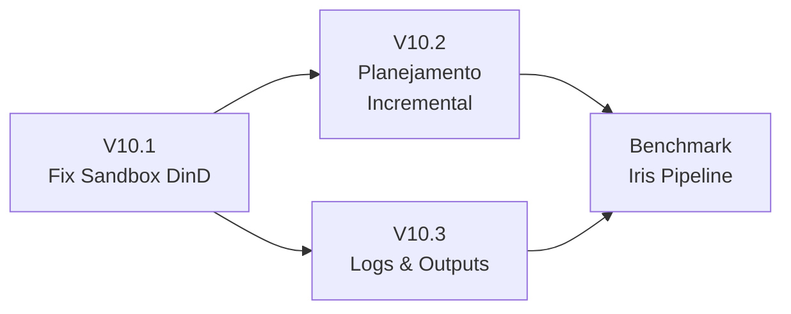

# Roadmap V10 — Estabilidade, Planejamento Incremental e Observabilidade de Execução

**Contexto:** A validação do pipeline de classificação Iris (benchmark principal) revelou três categorias críticas de falha que impedem o uso do sistema em produção:

1. **Sandbox de código quebrado** — O `python_interpreter` falha 100% das vezes quando invocado por agentes em containers Docker, devido a mapeamento incorreto de volumes no Docker-in-Docker (DinD).
2. **Planejamento destrutivo** — O ciclo Planner → Validator descarta planos inteiros a cada iteração, gerando centenas de tentativas sem progresso (184 subdiretórios em uma única execução).
3. **Outputs e logs ilegíveis** — A estrutura atual cria subdiretórios aninhados por agente/sessão/tarefa, tornando impossível acompanhar o estado de uma execução ou depurar falhas.

> **Escopo:** Este roadmap é estritamente de correção e melhoria incremental. Não introduz novas funcionalidades, apenas estabiliza as existentes.

---

## Diagnóstico Detalhado

### D1 — Sandbox DinD: `python: can't open file '/outputs/script.py'`

**Localização:** `src/skills/code/sandbox.py:71-86`

**Fluxo atual (com falha):**
```
Orquestrador (host) → Container do Agente (Docker) → Sandbox (Docker-in-Docker)
                       ↑ /outputs mapeado para      ↑ tenta montar /outputs
                         host:outputs/<session>/       mas o daemon Docker no HOST
                                                       não conhece o path dentro
                                                       do container do agente
```

**Causa raiz:** O `PythonSandbox.run()` calcula `abs_output_dir` usando `pathlib.Path(output_dir).resolve()`, que retorna o path absoluto **dentro do container do agente** (ex: `/outputs/sess_001/plan_iris`). Quando o sandbox tenta criar um novo container Docker via `self.client.containers.run(volumes={str(abs_output_dir): ...})`, o daemon Docker no **host** recebe esse path — que não existe no filesystem do host. Resultado: o container do sandbox é criado com um volume vazio, e o `script.py` nunca é montado.

**Evidência nos logs:**
```json
{"event": "skill_failed", "skill": "python_interpreter", "error": "python: can't open file '/outputs/script.py': [Errno 2] No such file or directory"}
```
Esse erro aparece em **todas** as execuções de sandbox analisadas (sessões cc2faf21, b9060d26, 88896ea6, dd25f992).

### D2 — Loop de Planejamento Destrutivo

**Localização:** `src/orchestrator.py:563-686` e `src/autonomous_loop.py:271-581`

**Problema:** O ciclo `_run_planning_loop` opera em modo "gerar do zero". A cada iteração que o Validator rejeita, o Planner recebe apenas uma string de feedback genérica e produz um plano completamente novo, sem acesso ao plano anterior. Isso causa:

- **Sem convergência:** O Planner não tem como iterar incrementalmente. Cada tentativa é independente.
- **Explosão de containers:** Na sessão `14a479a4`, foram spawnados 92 containers de planner e 92 de validator (184 total) sem nunca atingir aprovação.
- **Desperdício de tokens:** Cada par planner+validator consome ~4000 tokens. 92 iterações ≈ 368k tokens desperdiçados.

**Agravante:** O Validator pode retornar `corrected_plan` (linha 674), mas o Planner não recebe esse plano corrigido — ele recebe apenas o `reason` como feedback textual.

### D3 — Estrutura de Logs e Outputs Ilegível

**Localização:** `src/output_manager.py`, `src/runner.py:370-396`

**Problema atual:** Cada execução gera uma árvore como:
```
outputs/
├── cc2faf212845489280160077cc26f524/         ← UUID opaco
│   └── planner_5ed070bb/                      ← agente_sessão parcial
│       ├── artifacts/                         ← vazio
│       └── sess_001/
│           ├── plan_iris_pipeline/
│           │   └── script.py
│           └── test/
│               └── script.py
logs/
├── cc2faf212845489280160077cc26f524/
│   └── planner_5ed070bb/
│       └── agent.log                          ← log isolado deste agente
├── 14a479a4f92349b2b2a3f419d8783e01/
│   ├── planner_01d260d7/
│   │   └── agent.log
│   ├── planner_03970d47/
│   │   └── agent.log
│   └── ... (184 subdiretórios!)
```

**Consequências:**
- Impossível identificar a que execução um diretório pertence sem consultar o banco.
- Logs distribuídos em centenas de arquivos separados.
- Sem visão consolidada do fluxo: não se sabe quais agentes rodaram, em que ordem, e com que resultado.

---

## Etapas de Implementação

### Etapa V10.1 — Correção do Sandbox DinD

**Objetivo:** Garantir que o `python_interpreter` funcione corretamente quando o agente roda dentro de um container Docker que cria sub-containers via Docker-in-Docker.

**Critério de aceite:** Um agente em container executa `python_interpreter` com sucesso, gera um artefato em `/outputs/`, e o arquivo é visível no host.

#### V10.1.1 — Propagar `HOST_PROJECT_PATH` para o sandbox

O `ContainerRunner` já calcula o path do host para volumes de output (variável `output_session_host` em `runner.py:378-384`). O sandbox precisa da mesma lógica.

**Alterações em `src/skills/code/sandbox.py`:**

```python
def run(self, code, session_id, task_name, output_dir, ...):
    # ANTES (bugado):
    # abs_output_dir = pathlib.Path(output_dir).resolve() / session_id / task_name
    
    # DEPOIS (corrigido):
    # Se estamos dentro de um container, usar HOST_PROJECT_PATH
    host_root = os.environ.get("HOST_PROJECT_PATH")
    
    if host_root:
        # Container do agente: o path que o daemon Docker conhece é no host
        host_output_base = os.environ.get("HOST_OUTPUT_BASE_DIR", 
                                           str(pathlib.Path(host_root) / "outputs"))
        abs_output_dir_host = pathlib.Path(host_output_base) / session_id / task_name
        # Path local (dentro do container) para salvar o script
        abs_output_dir_local = pathlib.Path(output_dir) / session_id / task_name
    else:
        # Execução direta no host
        abs_output_dir_host = pathlib.Path(output_dir).resolve() / session_id / task_name
        abs_output_dir_local = abs_output_dir_host
    
    abs_output_dir_local.mkdir(parents=True, exist_ok=True)
    abs_output_dir_local.chmod(0o777)
    
    script_path = abs_output_dir_local / "script.py"
    script_path.write_text(code)
    
    # Monta o volume usando o path DO HOST
    container = self.client.containers.run(
        image=self.image,
        volumes={
            str(abs_output_dir_host): {"bind": "/outputs", "mode": "rw"}
        },
        ...
    )
```

#### V10.1.2 — Propagar `HOST_PROJECT_PATH` e `HOST_OUTPUT_BASE_DIR` nos containers de agentes

**Alterações em `src/runner.py`:**

Adicionar ao bloco de variáveis de ambiente (linha ~326):
```python
env = {
    ...
    "HOST_PROJECT_PATH": host_root or str(_root),
    "HOST_OUTPUT_BASE_DIR": output_session_host,
    ...
}
```

#### V10.1.3 — Testes

- [ ] Teste unitário: `tests/unit/test_sandbox_dind.py` — verifica que o path de volume é calculado corretamente com e sem `HOST_PROJECT_PATH`.
- [ ] Teste de integração: execução completa do agente base com `python_interpreter` em container Docker.

#### Tarefas V10.1

- [ ] Corrigir `src/skills/code/sandbox.py` para resolver paths DinD.
- [ ] Propagar `HOST_PROJECT_PATH` e `HOST_OUTPUT_BASE_DIR` em `src/runner.py`.
- [ ] Adicionar testes unitários e de integração.
- [ ] Commit: `fix(sandbox): corrige mapeamento de volumes DinD para python_interpreter`

---

### Etapa V10.2 — Planejamento Incremental (Planner + Validator)

**Objetivo:** Substituir o ciclo destrutivo "gerar do zero" por um fluxo de refinamento incremental onde o Validator produz correções específicas e o Planner aplica essas correções sem recriar o plano inteiro.

**Critério de aceite:** O ciclo Planner → Validator converge em no máximo 5 iterações para a tarefa do pipeline Iris. Nenhuma iteração descarta o plano inteiro.

#### V10.2.1 — Refatorar `_run_planning_loop` para refinamento incremental

**Alterações em `src/orchestrator.py`:**

O novo fluxo mantém o plano anterior como contexto e instrui o Planner a refiná-lo:

```python
async def _run_planning_loop(self, prompt, master_session_id):
    plan_data = None       # Plano acumulado entre iterações
    last_plan_str = ""
    feedback = ""
    
    for iteration in range(MAX_PLANNING_ITERATIONS):
        if plan_data is None:
            # Primeira iteração: pedir plano do zero
            planner_prompt = f"Crie um plano para: {prompt}"
        else:
            # Iterações subsequentes: refinar o plano existente
            planner_prompt = (
                f"Refine o plano existente com base no feedback do validador.\n\n"
                f"TAREFA ORIGINAL:\n{prompt}\n\n"
                f"PLANO ATUAL:\n{last_plan_str}\n\n"
                f"FEEDBACK DO VALIDADOR:\n{feedback}\n\n"
                f"INSTRUÇÕES:\n"
                f"- NÃO recrie o plano do zero.\n"
                f"- Aplique APENAS as correções solicitadas pelo validador.\n"
                f"- Mantenha as partes do plano que não foram criticadas.\n"
                f"- Retorne o plano completo (revisado) como array JSON."
            )
        
        # ... (execução do Planner e parsing do JSON)
        
        # Após parsing bem-sucedido:
        plan_data = parsed_plan
        last_plan_str = json.dumps(plan_data, indent=2)
        
        # Executar o Validator...
        # Se o Validator retornou corrected_plan, USAR DIRETAMENTE:
        corrected = val_data.get("corrected_plan")
        if corrected and isinstance(corrected, list):
            plan_data = corrected
            last_plan_str = json.dumps(plan_data, indent=2)
            # Resubmeter ao Validator para confirmação
            continue
        
        # Se revision_needed, usar o reason como feedback
        feedback = val_data.get("reason", "Plano precisa de revisão.")
```

#### V10.2.2 — Atualizar a instrução do Planner para suportar refinamento

**Alterações em `agents/planner/agent.py`:**

Adicionar ao `AGENT_INSTRUCTION`:
```
MODO DE REFINAMENTO:
Quando receber um plano existente junto com feedback do validador:
- Leia o plano atual com atenção.
- Identifique APENAS os pontos criticados no feedback.
- Aplique correções cirúrgicas sem alterar o que já estava aprovado.
- Retorne o plano completo (todas as subtarefas) como array JSON.
- NÃO recrie o plano inteiro — isso desperdiça recursos.
```

#### V10.2.3 — Atualizar a instrução do Validator para feedback estruturado

**Alterações em `agents/validator/agent.py`:**

Refinar o `AGENT_INSTRUCTION` para gerar feedback mais acionável:
```
REGRAS DE FEEDBACK:
1. Para cada problema encontrado, especifique:
   - O task_name afetado
   - O campo que precisa de correção (prompt, depends_on, validation_criteria, etc.)
   - A correção sugerida
2. Se o plano precisa de poucas correções, forneça o campo `corrected_plan` diretamente.
3. NÃO rejeite o plano inteiro por um problema em uma única subtarefa.
4. Aprove parcialmente quando possível: indique quais subtarefas estão corretas.
```

#### V10.2.4 — Limitar containers spawnados por ciclo de planejamento

**Alterações em `src/orchestrator.py`:**

Adicionar um limite hard-coded de iterações e log de contagem:
```python
MAX_PLANNING_ITERATIONS = int(os.getenv("MAX_PLANNING_ITERATIONS", "5"))
```
O valor atual é 15 (no `.env`). Reduzir o padrão para 5 — se não convergir em 5 iterações de refinamento incremental, o plano provavelmente é inviável.

#### Tarefas V10.2

- [ ] Refatorar `_run_planning_loop` em `src/orchestrator.py` para refinamento incremental.
- [ ] Atualizar `AGENT_INSTRUCTION` do Planner para modo de refinamento.
- [ ] Atualizar `AGENT_INSTRUCTION` do Validator para feedback estruturado.
- [ ] Reduzir `MAX_PLANNING_ITERATIONS` default de 15 para 5.
- [ ] Adicionar teste unitário: `tests/unit/test_incremental_planning.py`.
- [ ] Commit: `feat(planning): implementa ciclo de refinamento incremental Planner/Validator`

---

### Etapa V10.3 — Reestruturação de Logs e Outputs

**Objetivo:** Consolidar toda a saída de uma execução em um único diretório com identificador legível (data/hora) e unificar os logs em um único arquivo por execução.

**Critério de aceite:** Ao listar `outputs/` ou `logs/`, cada entrada corresponde a uma execução e é imediatamente identificável sem consultar o banco de dados.

#### V10.3.1 — Novo esquema de diretórios

**Estrutura proposta:**
```
outputs/
├── 2026-05-12_03h19_iris-pipeline/    ← diretório único por execução
│   ├── execution.log                   ← log consolidado de TODA a execução
│   ├── plan.json                       ← plano aprovado (se houver)
│   └── artifacts/                      ← todos os artefatos gerados
│       ├── script_plan_iris.py
│       └── ...
│
logs/
├── 2026-05-12_03h19_iris-pipeline.log  ← arquivo único de log por execução
```

**Formato do identificador:**
```
YYYY-MM-DD_HHhMM_<slug>
```
Onde `<slug>` é gerado a partir das primeiras palavras do prompt (slugificado, máximo 40 chars). Exemplos:
- `2026-05-12_03h19_iris-pipeline`
- `2026-05-11_18h53_implemente-pipeline-classificacao`

Se houver colisão (mesma data/hora/slug), adicionar sufixo numérico: `_2`, `_3`, etc.

#### V10.3.2 — Refatorar `OutputManager`

**Alterações em `src/output_manager.py`:**

```python
class OutputManager:
    def create_execution_dir(self, prompt: str, started_at: datetime) -> Path:
        """Cria o diretório raiz para uma nova execução.
        
        Args:
            prompt: Prompt original para gerar o slug.
            started_at: Timestamp de início.
            
        Returns:
            Path para o diretório da execução.
        """
        slug = self._slugify(prompt, max_len=40)
        ts = started_at.strftime("%Y-%m-%d_%Hh%M")
        dir_name = f"{ts}_{slug}"
        
        # Evitar colisão
        exec_dir = self.base_dir / dir_name
        counter = 2
        while exec_dir.exists():
            exec_dir = self.base_dir / f"{dir_name}_{counter}"
            counter += 1
        
        exec_dir.mkdir(parents=True)
        (exec_dir / "artifacts").mkdir()
        
        return exec_dir
    
    @staticmethod
    def _slugify(text: str, max_len: int = 40) -> str:
        """Converte texto em slug filesystem-safe."""
        import re
        import unicodedata
        text = unicodedata.normalize("NFKD", text)
        text = text.encode("ascii", "ignore").decode("ascii")
        text = re.sub(r"[^\w\s-]", "", text.lower())
        text = re.sub(r"[-\s]+", "-", text).strip("-")
        return text[:max_len]
```

**Remover:** `init_session()`, `get_task_dir()`, `get_logs_dir()` — substituídos pelo novo esquema.

#### V10.3.3 — Log consolidado por execução

**Alterações em `src/logger.py` e `src/orchestrator.py`:**

Criar um `ExecutionLogger` que escreve todas as entradas de log de uma execução em um único arquivo, incluindo metadados de agente e tarefa:

```python
class ExecutionLogger:
    """Logger dedicado a uma execução. Escreve em um único arquivo."""
    
    def __init__(self, log_path: Path):
        self.log_path = log_path
        self._file = open(log_path, "a", buffering=1)  # line-buffered
    
    def log(self, agent_id: str, task_name: str, level: str, 
            message: str, **extra):
        """Registra uma entrada no log da execução.
        
        Formato: JSON-lines com campos padronizados.
        """
        entry = {
            "timestamp": datetime.now(timezone.utc).isoformat(),
            "agent_id": agent_id,
            "task_name": task_name,
            "level": level,
            "message": message,
            **extra
        }
        self._file.write(json.dumps(entry, ensure_ascii=False) + "\n")
    
    def close(self):
        self._file.close()
```

**Cada entrada no log consolidado terá:**
| Campo | Descrição |
|---|---|
| `timestamp` | ISO 8601 com timezone |
| `agent_id` | `planner`, `validator`, `base`, etc. |
| `task_name` | Nome da subtarefa (ou `planning`, `validation`) |
| `level` | `INFO`, `WARNING`, `ERROR` |
| `message` | Mensagem descritiva |
| `status` | `started`, `completed`, `failed` (quando aplicável) |
| `duration_ms` | Tempo de execução (quando aplicável) |

#### V10.3.4 — Adaptar o `ContainerRunner` para o novo esquema

**Alterações em `src/runner.py`:**

Os containers de agentes deixam de receber diretórios individuais de log. Em vez disso:
- O volume `/outputs` aponta para `<exec_dir>/artifacts/`.
- O volume `/logs` aponta para `<exec_dir>/` (onde o `execution.log` está).
- Os logs dos agentes em container são capturados via IPC e escritos no `ExecutionLogger` centralizado.

#### V10.3.5 — Captura de logs dos agentes via IPC

**Alterações em `agents/runner.py` e `src/ipc.py`:**

Adicionar um tipo de mensagem IPC `log` que os agentes enviam para o orquestrador:
```python
# Mensagem IPC de log (agente → orquestrador)
{
    "type": "log",
    "session_id": "...",
    "payload": {
        "agent_id": "planner",
        "task_name": "plan_creation",
        "level": "INFO",
        "message": "Agente chamando ferramenta: memory",
        "extra": {"tool_args": {...}}
    }
}
```

O orquestrador recebe essas mensagens e as escreve no `ExecutionLogger` da execução em curso. Isso elimina a necessidade de volumes de log separados por agente.

**Alternativa simplificada (se IPC de logs for muito complexo):** Manter o volume `/logs` mapeado para o diretório da execução, mas todos os agentes escrevem no **mesmo** arquivo `execution.log` usando o campo `agent_id` para distinguir a origem. O `setup_file_logging()` em `agents/runner.py` passaria a usar o path `/logs/execution.log`.

#### V10.3.6 — Adaptar `handle_request` para o novo fluxo

**Alterações em `src/orchestrator.py`:**

```python
async def handle_request(self, prompt, ...):
    started_at = datetime.now(timezone.utc)
    
    # Cria diretório único para esta execução
    exec_dir = self.output_manager.create_execution_dir(prompt, started_at)
    exec_logger = ExecutionLogger(exec_dir / "execution.log")
    
    exec_logger.log("orchestrator", "init", "INFO",
                     f"Execução iniciada: {prompt[:100]}")
    
    # ... execução normal ...
    
    # Ao final, salva o plano aprovado
    if result.plan_json:
        (exec_dir / "plan.json").write_text(result.plan_json)
    
    exec_logger.log("orchestrator", "finish", "INFO",
                     f"Execução finalizada: {result.succeeded}/{result.total} sucesso")
    exec_logger.close()
```

#### V10.3.7 — Migração de dados (opcional)

Criar um script utilitário para reorganizar os diretórios de execuções anteriores no novo formato, usando timestamps do banco de dados:

```bash
# scripts/migrate_outputs_v10.py
# Lê execution_history do PostgreSQL e reorganiza outputs/ e logs/
```

#### Tarefas V10.3

- [ ] Implementar `_slugify()` e `create_execution_dir()` em `src/output_manager.py`.
- [ ] Implementar `ExecutionLogger` em `src/logger.py`.
- [ ] Adaptar `src/runner.py` para mapear volumes no novo esquema.
- [ ] Adaptar `agents/runner.py` para escrever logs no arquivo consolidado.
- [ ] Adaptar `src/orchestrator.py` para usar o novo fluxo.
- [ ] Adaptar `src/autonomous_loop.py` para propagar o `exec_dir`.
- [ ] Criar script de migração `scripts/migrate_outputs_v10.py` (opcional).
- [ ] Adicionar testes: `tests/unit/test_output_manager_v10.py`.
- [ ] Commit: `refactor(outputs): consolida logs e outputs em diretório único por execução`

---

## Resumo de Impacto

### Arquivos modificados

| Arquivo | Etapa | Tipo de Mudança |
|---|---|---|
| `src/skills/code/sandbox.py` | V10.1 | Correção de bug (DinD paths) |
| `src/runner.py` | V10.1, V10.3 | Propagação de env vars + novo esquema de volumes |
| `src/orchestrator.py` | V10.2, V10.3 | Refinamento incremental + novo fluxo de outputs |
| `src/autonomous_loop.py` | V10.3 | Propagação do exec_dir |
| `src/output_manager.py` | V10.3 | Reescrita completa |
| `src/logger.py` | V10.3 | Adição do ExecutionLogger |
| `agents/planner/agent.py` | V10.2 | Instrução de refinamento |
| `agents/validator/agent.py` | V10.2 | Instrução de feedback estruturado |
| `agents/runner.py` | V10.3 | Log unificado |
| `.env` / `.env.example` | V10.2 | Ajuste de MAX_PLANNING_ITERATIONS |

### Arquivos criados

| Arquivo | Etapa | Descrição |
|---|---|---|
| `tests/unit/test_sandbox_dind.py` | V10.1 | Testes de mapeamento DinD |
| `tests/unit/test_incremental_planning.py` | V10.2 | Testes do ciclo incremental |
| `tests/unit/test_output_manager_v10.py` | V10.3 | Testes do novo OutputManager |
| `scripts/migrate_outputs_v10.py` | V10.3 | Script de migração (opcional) |

### O que NÃO muda

- `src/skills/` (exceto `code/sandbox.py`) — Skills Framework intacto.
- `src/ipc.py` — Protocolo IPC intacto.
- `src/session.py` — Gerenciamento de sessões intacto.
- `src/telemetry.py` — Telemetria intacta.
- `src/llm/` — Abstração de LLM intacta.
- Schema do PostgreSQL — Sem migrações de banco.
- `docker-compose.yml` — Sem alterações de infraestrutura.

---

## Ordem de Execução Recomendada



1. **V10.1** primeiro — é um bugfix puro, sem dependências, e desbloqueia a execução de código.
2. **V10.2** e **V10.3** podem ser paralelizados, mas V10.3 deve estar pronto antes do benchmark final.
3. **Benchmark** — Re-executar o pipeline Iris após as três etapas para validar a correção.

---

## Critérios de Aceite Globais

1. O pipeline Iris executa do início ao fim sem falhas de sandbox.
2. O ciclo Planner → Validator converge em ≤ 5 iterações.
3. Cada execução do projeto produz **exatamente 1 diretório** em `outputs/` e **1 arquivo** em `logs/`.
4. O nome do diretório contém data, hora e slug legível do prompt.
5. O log consolidado permite reconstruir o fluxo completo da execução (qual agente, qual tarefa, que resultado).
6. Todos os testes existentes continuam passando (`uv run pytest`).
