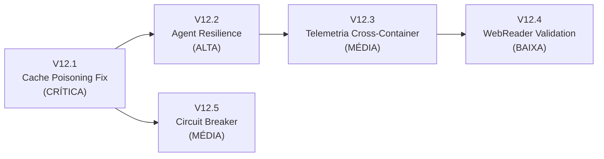

# Roadmap V12 — Resiliência de Agentes, Integridade de Cache e Instrumentação

**Contexto:** A execução completa do pipeline de classificação Iris (sessão `20260514_090456`) revelou uma cascata de falhas que resultou em 0/6 subtarefas concluídas com sucesso, 22 minutos de execução e ~50 containers Docker spawnados sem progresso. A análise diagnóstica identificou **9 problemas distintos** agrupados em 4 categorias. Este roadmap aborda todos eles com soluções estruturais, priorizando a causa raiz (cache de respostas falhas) que amplificou todos os outros problemas.

**Dependências:** Este roadmap assume que o V10 (sandbox DinD, sessões legíveis, planejamento incremental) e V11 (flush de telemetria, precisão de tokens, schema lean) já estão implementados. As tarefas V12 complementam e estendem essas fundações.

**Relatório de referência:** `execution_analysis_report.md` — análise detalhada com evidências de logs, tabelas de erros e cronologia.

---

## Diagnóstico Consolidado

### D1 — Cache LLM Envenena a Recuperação (P3 — CAUSA RAIZ)

**Problema:** O `LLMResponseCache` armazena respostas baseado no hash `model:prompt`. Quando uma subtarefa falha e é re-executada (via retry ou replanejamento), o prompt permanece idêntico, fazendo o cache servir a **mesma resposta falha** indefinidamente. Na execução analisada, isso causou 8 re-execuções idênticas ao longo de ~14 minutos — puro desperdício.

**Evidência:** Nos logs `base.log`, o hash `c2c255a4` foi servido como Cache HIT 7 vezes consecutivas (idades de 80s a 1066s), todas retornando a mesma resposta que originalmente havia falhado com `FileNotFoundError`.

**Impacto:** Este problema amplifica todos os outros. Mesmo que o planner gere planos diferentes ou o agente tenha capacidade de se recuperar, o cache garante que a mesma resposta falha será reutilizada.

### D2 — Agente Não Se Recupera de Erros Repetitivos (P1, P2)

**Problema:** O loop ReAct (`agent_loop.py`) permite até 10 iterações de chamadas de ferramenta, mas não possui detecção de padrões de erro repetitivos. Na execução analisada, o agente `base` chamou `python_interpreter` 8 vezes consecutivas com erros diferentes de matplotlib/pandas, e em nenhum momento simplificou a abordagem ou desistiu de uma estratégia que claramente não funcionava.

Adicionalmente, o agente `Data_Preprocessing` referenciou `/datasets/iris.csv` (inexistente) e, após o erro, gastou sua última iteração escrevendo uma "declaração de intenção" ("Vou criar o arquivo...") sem executar nenhuma ação.

**Impacto:** Mesmo sem o problema de cache, os agentes não conseguem se auto-corrigir em cenários com erros complexos do modelo local (Qwen3.5:4b).

### D3 — Telemetria Gerada em Container Não Persiste (P5, P6, P7)

**Problema:** O `agent_loop.py` executa dentro do container Docker do agente e registra `token_usage` e `tool_usage` no singleton local do `TelemetryCollector`. Porém, esse singleton é uma instância separada da instância do orquestrador. O buffer do container raramente atinge o limiar de 50 entradas para flush automático, e não há chamada explícita de `flush()` antes do encerramento do processo. Resultado: as tabelas `token_usage` e `tool_usage` no PostgreSQL ficam vazias.

**Nota:** O V11 já propõe a adição de `flush()` no `agents/runner.py`. As tarefas aqui complementam com a verificação de conectividade e a correta extração de dados do `response.usage`.

### D4 — WebReader Sem Validação de Schema e Search-First (P8)

**Problema:** O skill `web_reader` aceita URLs com schema `file://`, tentando verificar `robots.txt` de um protocolo local — o que é absurdo. Além disso, o LLM pode inventar (alucinar) URLs que nunca existiram. O comportamento correto seria: primeiro buscar por termos em uma API de busca (como o `quick_search`), e depois acessar os resultados retornados pela API.

**Evidência:** Em `base.log`, o agente tentou acessar `file:///outputs/script.py` via `web_reader` e recebeu "Bloqueado pelo robots.txt".

### D5 — Desperdício de Recursos em Ciclos Sem Progresso (P9)

**Problema:** O sistema não detecta que ciclos consecutivos produzem resultados idênticos. Na execução analisada, 10 ciclos de replanejamento + execução ocorreram sem nenhuma mudança no resultado, spawnando ~40 containers desnecessários.

---

## Etapas de Implementação

### Etapa V12.1 — Invalidação Inteligente de Cache LLM (Prioridade: CRÍTICA)

**Objetivo:** Impedir que o cache sirva respostas associadas a execuções falhas, sem perder o benefício de caching para respostas bem-sucedidas.

#### Tarefas:
- [ ] **V12.1.1 — Cache-busting por injeção de contexto de erro.** Quando uma subtarefa falha e é re-executada (retry no `autonomous_loop.py`), o prompt da próxima tentativa deve incluir um prefixo com o erro anterior e o número da tentativa. Isso invalida naturalmente o hash do cache.
  - **Arquivo:** `src/autonomous_loop.py` — bloco de retry em `_execute_task_in_dag` (L405-459).
  - **Lógica:** Se `result.status != "success"`, concatenar ao `enriched_task.prompt` um bloco:
    ```
    [TENTATIVA ANTERIOR FALHOU]
    Tentativa: {attempt+1}/{max_retries}
    Erro: {result.error}
    Instrução: Tente uma abordagem diferente para resolver o problema.
    ```
  - **Efeito:** O hash do prompt muda entre tentativas, forçando o cache a fazer MISS.

- [ ] **V12.1.2 — Nunca cachear respostas vazias ou com erro.** No runner do agente (`agents/runner.py`), ao verificar se deve gravar no cache, ignorar respostas com `status == "error"` ou texto vazio.
  - **Arquivo:** `agents/runner.py` ou `agents/base/agent.py` — ponto onde `llm_cache.set()` é invocado.
  - **Condição:** `if response_text and len(response_text.strip()) > 50:` (evitar cachear respostas triviais).

- [ ] **V12.1.3 — Invalidação por session ao replanear.** No `autonomous_loop.py`, antes de iniciar um novo ciclo de replanejamento, registrar os hashes de prompts das subtarefas falhas e invalidá-los no cache.
  - **Arquivo:** `src/llm_cache.py` — adicionar método `invalidate(prompt: str, model: str)`.
  - **Arquivo:** `src/autonomous_loop.py` — chamar invalidação antes de `_run_planning_loop`.

- [ ] **V12.1.4 — Testes unitários para a lógica de invalidação.**
  - Cenário 1: Resposta falha não é cacheada.
  - Cenário 2: Resposta falha existente é invalidada antes de retry.
  - Cenário 3: Retry com cache-busting gera hash diferente.
  - **Arquivo:** `tests/unit/test_llm_cache_invalidation.py`

---

### Etapa V12.2 — Resiliência do Agent Loop (Prioridade: ALTA)

**Objetivo:** Dotar o loop ReAct de mecanismos de detecção de erros repetitivos e recuperação inteligente, evitando que o agente gaste todas as iterações repetindo a mesma abordagem falha.

#### Tarefas:
- [ ] **V12.2.1 — Detecção de erros repetitivos no `agent_loop.py`.** Manter um buffer dos últimos N erros de ferramenta. Se o mesmo tipo de exceção (`TypeError`, `FileNotFoundError`, `IndexError`) ocorrer 3 vezes consecutivas na mesma ferramenta, injetar uma mensagem de sistema forçando o agente a mudar de estratégia.
  - **Arquivo:** `src/llm/agent_loop.py` — bloco de execução de ferramentas (L157-247).
  - **Lógica:** Criar uma classe `ErrorTracker` com `track(tool_name, error_type) -> bool` que retorna `True` se o limiar foi atingido.
  - **Mensagem de recuperação injetada:**
    ```
    [ATENÇÃO DO SISTEMA]
    A ferramenta '{tool_name}' falhou {N} vezes consecutivas com o erro '{error_type}'.
    Você DEVE mudar completamente sua abordagem. Opções:
    1. Simplificar o código removendo a parte problemática
    2. Usar uma estratégia alternativa
    3. Gerar a resposta sem usar essa ferramenta
    NÃO repita a mesma abordagem.
    ```

- [ ] **V12.2.2 — Detecção de resposta final vazia ou declarativa.** Após o loop ReAct encerrar, verificar se `final_response` é vazio ou contém apenas declarações de intenção sem resultado concreto.
  - **Arquivo:** `src/llm/agent_loop.py` — após o loop (L248-256).
  - **Heurística:** Se a resposta contém padrões como `"Vou criar"`, `"Vou fazer"`, `"Irei"` sem tool calls e sem resultado de dados, marcar como resposta insatisfatória e fazer uma última tentativa com prompt de recuperação.

- [ ] **V12.2.3 — Limite de tentativas por ferramenta.** Implementar um contador por ferramenta dentro do loop ReAct. Após 4 chamadas falhas à mesma ferramenta, removê-la da lista de `openai_tools` disponíveis para o modelo, forçando-o a responder sem ela.
  - **Arquivo:** `src/llm/agent_loop.py` — manter `tool_failure_count: Dict[str, int]` e filtrar `openai_tools` antes de cada chamada ao LLM.

- [ ] **V12.2.4 — Testes unitários para detecção de erros e recuperação.**
  - **Arquivo:** `tests/unit/llm/test_agent_loop_resilience.py`
  - Cenário 1: Após 3 `TypeError` consecutivos, mensagem de sistema é injetada.
  - Cenário 2: Ferramenta removida da lista após 4 falhas.
  - Cenário 3: Resposta declarativa é interceptada e re-tentada.

---

### Etapa V12.3 — Arquitetura de Telemetria Cross-Container (Prioridade: MÉDIA)

**Objetivo:** Garantir que as métricas de `token_usage` e `tool_usage` geradas dentro dos containers Docker dos agentes sejam persistidas no PostgreSQL, mesmo quando o buffer não atinge o limiar de flush.

> **Nota:** As ações V11.1.1 e V11.2.1 tratam do flush explícito e da correção do `response.usage`. As tarefas aqui complementam com verificação de conectividade e um canal alternativo de propagação via IPC.

#### Tarefas:
- [ ] **V12.3.1 — Propagar métricas de telemetria via resposta IPC.** O runner do agente (`agents/runner.py`) deve incluir no payload da resposta IPC um campo `_telemetry` com os dados de token_usage e tool_usage acumulados durante a execução. O orquestrador os extrai e grava no singleton central.
  - **Arquivo:** `agents/runner.py` — antes de enviar a resposta, serializar o buffer de telemetria pendente.
  - **Arquivo:** `src/orchestrator.py` — em `_execute_agent`, após receber `response_msg`, verificar `response_msg.payload.get("_telemetry")` e gravar via o singleton do orquestrador.
  - **Benefício:** Funciona mesmo que o container não tenha acesso direto ao PostgreSQL.

- [ ] **V12.3.2 — Corrigir extração de tokens do dicionário `usage`.** No `agent_loop.py`, substituir `getattr(response, "prompt_tokens", 0)` por `response.usage.get("prompt_tokens", 0)`. Fazer o mesmo para `completion_tokens`.
  - **Arquivo:** `src/llm/agent_loop.py` (L126-127).
  - **Nota:** O `OllamaProvider` já popula `usage` com `prompt_eval_count` e `eval_count` mapeados para `prompt_tokens` e `completion_tokens` (L110-114 de `providers/ollama.py`).

- [ ] **V12.3.3 — Propagar `retry_count` para `subtask_metrics`.** No `autonomous_loop.py`, após o retry loop, passar o valor de `attempt` para a chamada final de `record_subtask_metrics` no `_execute_agent`.
  - **Arquivo:** `src/autonomous_loop.py` — enriquecer `enriched_task` com um campo `retry_attempt`.
  - **Arquivo:** `src/orchestrator.py` — usar `task.retry_attempt` no `record_subtask_metrics` final.

- [ ] **V12.3.4 — Teste de integração para fluxo completo de telemetria.**
  - **Arquivo:** `tests/integration/test_telemetry_cross_container.py`
  - Cenário: Simular uma execução onde o agente gera token_usage e tool_usage, verificar que os dados aparecem no PostgreSQL após a execução completa via o canal IPC.

---

### Etapa V12.4 — WebReader: Validação de Schema e Estratégia Search-First (Prioridade: BAIXA)

**Objetivo:** Impedir que o `web_reader` processe URLs inválidas (schema `file://`) e reduzir alucinações de URL adotando uma estratégia de busca → leitura.

#### Tarefas:
- [ ] **V12.4.1 — Validar schema de URL no `web_reader`.** Rejeitar URLs com schema diferente de `http://` e `https://` com mensagem clara redirecionando para a ferramenta correta.
  - **Arquivo:** `src/skills/web_reader/skill.py`
  - **Mensagem de retorno:** `"Erro: URL com schema '{schema}' não é suportada. Para ler arquivos locais, use a ferramenta 'python_interpreter' com open()."`

- [ ] **V12.4.2 — Corrigir tratamento de robots.txt para HTTP 404.** Se a requisição ao `robots.txt` retornar status 404, assumir que o acesso é permitido (comportamento padrão da web, conforme RFC 9309).
  - **Arquivo:** `src/skills/web_reader/skill.py` — bloco de verificação de `robots.txt`.

- [ ] **V12.4.3 — Documentar estratégia Search-First nas instruções dos agentes.** Atualizar as instruções de sistema (system prompts) dos agentes `base` e `researcher` para instruir explicitamente que URLs devem ser obtidas via `quick_search` antes de serem acessadas com `web_reader`, nunca inventadas.
  - **Arquivo:** `agents/base/agent.py` — system prompt.
  - **Arquivo:** `agents/researcher/agent.py` — system prompt.
  - **Instrução adicionada:**
    ```
    IMPORTANTE: Nunca invente URLs. Sempre use a ferramenta 'quick_search' primeiro
    para encontrar URLs reais e relevantes. Depois, use 'web_reader' para ler o
    conteúdo dessas URLs retornadas pela busca.
    ```

- [ ] **V12.4.4 — Testes unitários para validação de schema e robots.txt.**
  - **Arquivo:** `tests/unit/skills/test_web_reader_validation.py`
  - Cenário 1: URL `file://` retorna erro claro.
  - Cenário 2: robots.txt 404 permite acesso.
  - Cenário 3: robots.txt 200 com bloqueio é respeitado.

---

### Etapa V12.5 — Circuit Breaker e Detecção de Progresso Zero (Prioridade: MÉDIA)

**Objetivo:** Evitar desperdício de recursos detectando ciclos de execução sem progresso e abortando com mensagem explicativa.

#### Tarefas:
- [ ] **V12.5.1 — Implementar detecção de progresso zero.** No `autonomous_loop.py`, após cada ciclo de execução, calcular um "hash de progresso" baseado no conjunto de subtarefas bem-sucedidas. Se dois ciclos consecutivos produzirem o mesmo hash, abortar com diagnóstico claro.
  - **Arquivo:** `src/autonomous_loop.py` — método `_run_complex_path` (L271-598).
  - **Lógica:** `progress_hash = hash(frozenset(succeeded_tasks))`. Se `progress_hash == previous_progress_hash`, encerrar o loop de replanejamento com mensagem:
    ```
    "Execução interrompida: nenhum progresso detectado entre ciclos consecutivos.
    Subtarefas falhas: {failed_tasks}.
    Erros persistentes: {errors}.
    Considere revisar o prompt ou as dependências do ambiente."
    ```

- [ ] **V12.5.2 — Limite de containers por sessão.** Adicionar um contador global de containers spawnados por `master_session_id`. Se ultrapassar um limiar configurável (`MAX_CONTAINERS_PER_SESSION`, default: 30), abortar a execução.
  - **Arquivo:** `src/orchestrator.py` — incrementar contador em `_execute_agent`.
  - **Configuração:** `src/config.py` — `MAX_CONTAINERS_PER_SESSION`.

- [ ] **V12.5.3 — Testes unitários para circuit breaker.**
  - **Arquivo:** `tests/unit/test_circuit_breaker.py`
  - Cenário 1: Progresso zero em 2 ciclos → aborta.
  - Cenário 2: Progresso real entre ciclos → continua.
  - Cenário 3: Limite de containers atingido → aborta com erro descritivo.

---

## Ordem de Execução Recomendada



1. **V12.1 (Cache)** — Resolver a causa raiz que amplifica todos os outros problemas. Sem isso, as correções de V12.2 e V12.5 terão eficácia limitada.
2. **V12.2 (Agent Loop)** — Dotar os agentes de capacidade real de recuperação. Pode ser feita em paralelo com V12.5.
3. **V12.5 (Circuit Breaker)** — Proteção contra desperdício de recursos. Baixo esforço, alto valor preventivo.
4. **V12.3 (Telemetria)** — Complementa o V11. Depende de estabilidade básica dos agentes.
5. **V12.4 (WebReader)** — Menor prioridade, impacto localizado.

---

## Resumo de Impacto

### Arquivos Modificados
| Arquivo | Etapas | Natureza da Mudança |
|---------|--------|---------------------|
| `src/autonomous_loop.py` | V12.1.1, V12.1.3, V12.3.3, V12.5.1 | Cache-busting no retry, invalidação pré-replan, progresso zero |
| `src/llm/agent_loop.py` | V12.2.1, V12.2.2, V12.2.3, V12.3.2 | ErrorTracker, resposta declarativa, filtro de ferramentas, extração de tokens |
| `src/llm_cache.py` | V12.1.2, V12.1.3 | Método `invalidate()`, filtro de respostas falhas |
| `agents/runner.py` | V12.1.2, V12.3.1 | Filtro de cache em set, propagação IPC de telemetria |
| `src/orchestrator.py` | V12.3.1, V12.3.3, V12.5.2 | Extração de telemetria IPC, retry_count, limite de containers |
| `src/config.py` | V12.5.2 | Nova variável `MAX_CONTAINERS_PER_SESSION` |
| `src/skills/web_reader/skill.py` | V12.4.1, V12.4.2 | Validação de schema, correção de robots.txt 404 |
| `agents/base/agent.py` | V12.4.3 | Instrução Search-First no system prompt |
| `agents/researcher/agent.py` | V12.4.3 | Instrução Search-First no system prompt |

### Arquivos Criados
| Arquivo | Etapa |
|---------|-------|
| `tests/unit/test_llm_cache_invalidation.py` | V12.1.4 |
| `tests/unit/llm/test_agent_loop_resilience.py` | V12.2.4 |
| `tests/integration/test_telemetry_cross_container.py` | V12.3.4 |
| `tests/unit/skills/test_web_reader_validation.py` | V12.4.4 |
| `tests/unit/test_circuit_breaker.py` | V12.5.3 |

---

## Critérios de Aceite Globais

1. **Cache não amplifica falhas:** Uma subtarefa que falha na primeira tentativa tem resposta diferente na segunda tentativa (hash do prompt diferente, cache MISS garantido).
2. **Agente se recupera:** Ao encontrar 3 `TypeError` consecutivos no `python_interpreter`, o agente muda de abordagem automaticamente (simplificação ou remoção da parte problemática).
3. **Token usage real:** Após uma execução com Ollama, a tabela `token_usage` no PostgreSQL contém ao menos um registro com `prompt_tokens > 0` e `completion_tokens > 0`, refletindo os valores reais do `prompt_eval_count` e `eval_count`.
4. **Zero desperdício:** Se dois ciclos consecutivos de execução resultam no mesmo conjunto de subtarefas bem-sucedidas, o sistema aborta com diagnóstico claro em vez de continuar spawnando containers.
5. **WebReader seguro:** Uma chamada com URL `file:///local/path` retorna erro descritivo, não tenta buscar `robots.txt`.
6. **Benchmark Iris:** O pipeline completo executa com no máximo 2 ciclos de replanejamento, gerando artefatos reais (CSV, modelo, relatório EDA), sem ciclos de cache idênticos.
