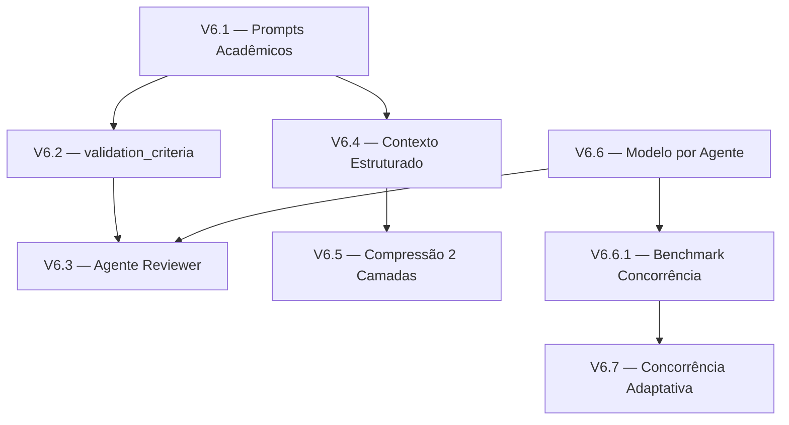

# Roadmap V6 — Autonomia de Pesquisa e Cadeia de Validação

**Contexto:** Este roadmap foca em elevar a capacidade do GeminiClaw de conduzir pesquisas de forma autônoma. O objetivo é que o sistema consiga: definir metodologia de pesquisa replicável, decompor etapas via planejamento estruturado, e validar resultados através de uma cadeia robusta de verificação.

> **Pré-requisito:** Roadmaps V1–V4 concluídos.
> **Relacionado:** Roadmap V5 (Observabilidade) é complementar, não bloqueante.

---

## Estado Atual e Gaps

### O que já existe

- Planner gera plano JSON com subtarefas, dependências e artefatos esperados
- Validator revisa o plano (até 3 iterações) verificando dependências, viabilidade e clareza
- DAG executa subtarefas em paralelo respeitando dependências
- Re-planejamento automático quando subtarefas falham
- Researcher faz busca web (DuckDuckGo) e síntese em Markdown
- Summarizer consolida múltiplos relatórios em documento final

### Gaps críticos para pesquisa autônoma

| # | Gap | Impacto |
|---|---|---|
| 1 | Researcher não define **metodologia de pesquisa** — apenas busca e reporta | Pesquisas não são replicáveis |
| 2 | Não existe **validação de resultados** (apenas validação de planos) | Resultados podem ser alucinados |
| 3 | Researcher não distingue **tipos de fonte** (primária, secundária, grey lit) | Qualidade das fontes não é controlada |
| 4 | Researcher não consulta **bases locais** (Qdrant, SQLite, memórias) antes de buscar na web | Ignora conhecimento já adquirido |
| 5 | Planner não consegue instanciar **múltiplos agentes do mesmo tipo** em paralelo | Limita throughput de pesquisas paralelas |
| 6 | Prompts dos agentes são genéricos e não refletem papéis acadêmicos | Baixa qualidade das entregas |
| 7 | Summarizer recebe texto bruto sem estrutura — perde metadados | Síntese perde rastreabilidade |
| 8 | Não existe um agente **Reviewer** que avalie a qualidade do output final | Sem quality gate na saída |

---

## Etapa V6.1 — Aprimoramento dos Prompts dos Agentes

**Objetivo:** Reescrever as instruções de cada agente para refletir papéis acadêmicos bem definidos, com comportamentos explícitos e replicáveis.

### Researcher → Pesquisador Acadêmico e Metodólogo

O Researcher é responsável por **definir a metodologia de pesquisa**, pois ele possui acesso direto às fontes de dados (web, Qdrant, SQLite, memórias) e consegue avaliar a disponibilidade e qualidade das informações antes de propor como a pesquisa deve ser conduzida.

```
Adições ao prompt do Researcher:

DEFINIÇÃO DE METODOLOGIA (antes de iniciar a pesquisa):
1. **Consultar bases locais primeiro**: Use `memory` (ação `recall`) para verificar se há pesquisas anteriores sobre o tema. Consulte documentos indexados no Qdrant via `deep_search` e `document_processor` (ação `search`) se disponível.
2. **Definir objetivo da pesquisa**: O que se busca responder ou validar.
3. **Definir tipo de revisão**: Narrativa, sistemática, scoping review ou análise exploratória.
4. **Estabelecer critérios de busca**: Termos-chave, operadores booleanos, período temporal.
5. **Definir critérios de inclusão/exclusão**: Tipos de fonte aceitos e descartados.
6. **Registrar a metodologia no relatório**: A seção "Metodologia de Busca" é obrigatória.

ESTRATÉGIA DE BUSCA AVANÇADA:
1. **Formulação de queries**: Use operadores booleanos (AND, OR, NOT).
   Ex: "machine learning" AND "raspberry pi" AND ("edge computing" OR "embedded")
2. **Consulta a bases locais**: Antes de buscar na web, consulte:
   - Memórias de longo prazo (`memory` → `recall`)
   - Documentos do usuário indexados (`document_processor` → `search`)
   - Índice vetorial do Qdrant (`deep_search` se domínios configurados)
3. **Diversificação de fontes web**: Busque com pelo menos 3 queries diferentes.
4. **Classificação de fontes**:
   - 🟢 Primária: artigos peer-reviewed, papers (arxiv, IEEE, ACM)
   - 🟡 Secundária: documentação oficial, relatórios técnicos, livros
   - 🔴 Terciária: blogs, fóruns, posts em redes sociais
5. **Extração estruturada**: Para cada fonte, registre:
   - Título, Autor(es), Ano, URL
   - Relevância (alta/média/baixa) e justificativa
   - Citação-chave ou dado relevante extraído

FORMATO DE SAÍDA (tabela de fontes):
| # | Tipo | Título | Autor | Ano | URL | Relevância | Citação-chave |
```

### Planner → Orquestrador de Tarefas

O Planner recebe o contexto metodológico gerado pelo Researcher e decompõe a execução em tarefas paralelizáveis, atribuindo agentes e ferramentas adequados. Ele pode instanciar **múltiplos agentes do mesmo tipo** para executar em paralelo.

```
Adições ao prompt do Planner:

DECOMPOSIÇÃO BASEADA EM CONTEXTO:
Ao receber o contexto do Researcher (com metodologia e fontes disponíveis), o Planner DEVE:
1. Quebrar a metodologia em subtarefas executáveis por agentes em paralelo.
2. Atribuir ferramentas adequadas a cada subtarefa com base no que está disponível.
3. Instanciar múltiplos agentes do mesmo tipo quando necessário:
   Ex: 3 agentes `base` trabalhando em análises diferentes em paralelo.
   Ex: 2 agentes `researcher` cobrindo aspectos distintos do tema.
4. Maximizar paralelismo no DAG — evitar dependências desnecessárias.
5. Incluir `validation_criteria` em cada subtarefa.

SELEÇÃO DE MODELO POR TAREFA:
Para cada subtarefa, especifique o campo `preferred_model` indicando qual modelo é mais adequado:
- Tarefas de raciocínio complexo → modelo com thinking mode
- Tarefas de execução direta (busca, geração de código) → modelo rápido
O orquestrador usará essa informação para configurar a instância do agente.

TEMPLATE:
{
  "task_name": "analise_dados_1",
  "agent_id": "base",
  "prompt": "...",
  "depends_on": ["levantamento_fontes"],
  "expected_artifacts": ["analise_1.md"],
  "validation_criteria": ["contém pelo menos 3 métricas numéricas"],
  "preferred_model": "qwen3.5:4b"
}
```

### Validator → Revisor Acadêmico de Planos e Metodologias

O Validator revisa **tanto a metodologia do Researcher quanto o planejamento do Planner**, garantindo rigor acadêmico e viabilidade técnica.

```
Adições ao prompt do Validator:

VALIDAÇÃO DE METODOLOGIA (output do Researcher):
6. **OBJETIVO CLARO**: A pesquisa tem um objetivo bem definido e alcançável?
7. **TIPO DE REVISÃO**: O tipo de revisão é adequado para o objetivo?
8. **CRITÉRIOS DE BUSCA**: Os termos são específicos e usam operadores booleanos?
9. **PERÍODO TEMPORAL**: O período definido é adequado para o tema?
10. **CRITÉRIOS DE INCLUSÃO/EXCLUSÃO**: São explícitos e justificáveis?
11. **CONSULTA LOCAL**: O Researcher verificou bases locais antes de buscar na web?

VALIDAÇÃO DE PLANEJAMENTO (output do Planner):
12. **DEPENDÊNCIAS**: Os campos `depends_on` são válidos e sem ciclos?
13. **VIABILIDADE NO Pi 5**: O plano é executável com 8 GB RAM e 4 cores?
14. **PARALELISMO**: O DAG maximiza execução paralela?
15. **MÚLTIPLAS INSTÂNCIAS**: Se há múltiplos agentes do mesmo tipo, há conflito de recursos?
16. **VALIDATION_CRITERIA**: Cada subtarefa tem critérios verificáveis?
17. **MODELO ADEQUADO**: O `preferred_model` é coerente com a complexidade da tarefa?

REGRAS DE REJEIÇÃO:
- Rejeite planos com mais de 7 subtarefas.
- Rejeite metodologias sem critérios de inclusão/exclusão.
- Rejeite planos onde o Researcher não consultou bases locais.
```

### Summarizer → Sintetizador Acadêmico

Aprimorar o Summarizer para produzir sínteses com rastreabilidade completa.

```
Adições ao prompt do Summarizer:

RASTREABILIDADE OBRIGATÓRIA:
- Cada afirmação no relatório final DEVE ter uma referência [1], [2], etc.
- A seção de referências DEVE incluir TODAS as fontes citadas com URL.
- Se houver contradições entre fontes, DESTAQUE explicitamente.
- Inclua uma tabela de evidências cruzadas quando possível.

ANÁLISE CRÍTICA:
- Identifique limitações das fontes encontradas.
- Aponte gaps na literatura se perceber ausência de cobertura.
- Classifique o nível de confiança da conclusão (alto/médio/baixo).
```

### Tarefas V6.1

- [x] Reescrever `agents/planner/agent.py` AGENT_INSTRUCTION com decomposição baseada em contexto
- [x] Reescrever `agents/researcher/agent.py` AGENT_INSTRUCTION com metodologia e consulta local
- [x] Expandir `agents/validator/agent.py` AGENT_INSTRUCTION com validação de metodologia + plano
- [x] Reescrever `agents/summarizer/agent.py` AGENT_INSTRUCTION com rastreabilidade
- [x] Adicionar testes unitários validando que os prompts contêm seções obrigatórias
- [x] Atualizar prompts para refletir novos papéis (metodologia no researcher, decomposição no planner)
- [x] Commit: `refactor(agents): reescreve prompts com papéis acadêmicos e metodologia`

---

## Etapa V6.2 — Campo `validation_criteria` no Plano

**Objetivo:** Estender o formato do plano JSON para incluir critérios de validação explícitos por subtarefa, que serão verificados após a execução.

### Extensão do formato de plano

```json
{
  "task_name": "analise_dados",
  "agent_id": "base",
  "prompt": "...",
  "depends_on": ["coleta_dados"],
  "expected_artifacts": ["analise.md", "grafico.png"],
  "validation_criteria": [
    "O arquivo analise.md contém pelo menos 3 seções",
    "O gráfico grafico.png foi gerado com sucesso",
    "Todas as métricas mencionadas possuem valores numéricos"
  ]
}
```

### Implementação

Estender `AgentTask` com campo `validation_criteria`:

```python
@dataclass
class AgentTask:
    agent_id: str
    image: str
    prompt: str
    task_name: str = ""
    depends_on: list[str] = field(default_factory=list)
    expected_artifacts: list[str] = field(default_factory=list)
    validation_criteria: list[str] = field(default_factory=list)  # NOVO
    preferred_model: str | None = None  # NOVO (V6.6)
```

### Tarefas V6.2

- [ ] Adicionar `validation_criteria` e `preferred_model` ao `AgentTask` dataclass
- [ ] Atualizar `_run_planning_loop` para parsear os novos campos do JSON
- [ ] Atualizar prompt do Planner para incluir `validation_criteria` no template
- [ ] Atualizar prompt do Validator para verificar presença de `validation_criteria`
- [ ] Testes unitários: parsing de plano com `validation_criteria`
- [ ] Commit: `feat(orchestrator): adiciona validation_criteria ao formato de plano`

---

## Etapa V6.3 — Agente Reviewer (Validação de Resultados)

**Objetivo:** Criar um novo agente que verifica se os resultados produzidos por cada subtarefa atendem aos `validation_criteria` definidos no plano.

### Diferença entre Validator e Reviewer

| Aspecto | Validator | Reviewer |
|---|---|---|
| **Quando atua** | Antes da execução (valida metodologia e plano) | Depois da execução (valida o resultado) |
| **O que avalia** | Estrutura, dependências, viabilidade, rigor metodológico | Qualidade, completude, aderência a critérios |
| **Input** | JSON do plano OU metodologia do Researcher | Resultado da subtarefa + validation_criteria |
| **Output** | approved / revision_needed / rejected | pass / fail + feedback específico |

### Prompt do Reviewer

```
Você é o Agente Revisor do framework GeminiClaw. Sua função é avaliar se o
resultado produzido por uma subtarefa atende aos critérios de qualidade definidos.

VOCÊ RECEBE:
1. O resultado/output da subtarefa (texto ou referência a artefatos)
2. Os validation_criteria definidos no plano
3. Os expected_artifacts esperados

SEU CHECKLIST:
1. **ARTEFATOS**: Todos os expected_artifacts foram gerados?
2. **CRITÉRIOS**: Cada validation_criteria foi atendido?
3. **ALUCINAÇÕES**: O resultado contém informações sem fonte?
4. **COMPLETUDE**: O resultado cobre o que foi solicitado no prompt da subtarefa?
5. **CONSISTÊNCIA**: O resultado é consistente com os outputs de subtarefas anteriores?

FORMATO DE RESPOSTA:
{
  "status": "pass" | "fail",
  "criteria_results": [
    {"criterion": "...", "met": true/false, "evidence": "..."}
  ],
  "issues": ["..."],
  "confidence": 0.0-1.0
}
```

### Integração no Pipeline

```
Researcher (define metodologia)
    → Validator (valida metodologia)
        → Planner (decompõe em tarefas)
            → Validator (valida plano)
                → Execução DAG
                    → Reviewer (valida resultados por subtarefa)
                        → Summarizer (síntese final)
                              ↑
                              └── retry se fail ─────────────────────┘
```

O Reviewer é invocado após cada subtarefa (ou ao final de todas, dependendo da config):

```python
# Em src/autonomous_loop.py, após execução bem-sucedida de uma subtarefa:
if task.validation_criteria and REVIEW_ENABLED:
    review_result = await self._review_subtask(task, result, master_session_id)
    if review_result["status"] == "fail":
        # Marca como falha para trigger de retry
        ...
```

### Tarefas V6.3

- [ ] Criar `agents/reviewer/` com agent.py, prompt especializado
- [ ] Criar `containers/Dockerfile.reviewer`
- [ ] Adicionar `"reviewer"` ao `AGENT_REGISTRY` no orchestrator
- [ ] Implementar `_review_subtask()` no `AutonomousLoop`
- [ ] Configuração: `REVIEW_MODE=per_subtask|end_only|disabled` via .env
- [ ] Adicionar script de build da imagem Docker do reviewer
- [ ] Testes unitários: review de subtarefa com critérios pass/fail
- [ ] Testes de integração: pipeline completo com reviewer ativo
- [ ] Commit: `feat(agents): cria agente Reviewer para validação de resultados`

---

## Etapa V6.4 — Passagem de Contexto Estruturada entre Agentes

**Objetivo:** Substituir a passagem de contexto textual bruta (plain text truncado) por um formato estruturado que preserve metadados e fontes.

### Problema Atual

Hoje, o contexto entre subtarefas é passado como texto bruto:

```python
# autonomous_loop.py — _build_context_prefix()
context = f"### Resultado de `{task_name}`\n{entry.value}"
# → entry.value é a resposta textual crua do agente
```

Isso causa:
- Perda de metadados (fontes, timestamps, tipo de dado)
- Truncagem cega (pode cortar no meio de uma citação)
- Sem diferenciação entre tipos de artefato (tabela, código, texto)

### Formato Estruturado Proposto

```python
@dataclass
class SubtaskOutput:
    """Output estruturado de uma subtarefa para propagação via DAG."""
    task_name: str
    agent_id: str
    status: str

    # Conteúdo principal
    text_summary: str          # Resumo textual (max 2000 chars)
    artifacts: list[dict]      # [{"name": "fontes.md", "path": "/outputs/...", "type": "markdown"}]

    # Metadados de pesquisa
    sources: list[dict]        # [{"title": "...", "url": "...", "type": "primary"}]
    data_points: list[dict]    # Dados quantitativos extraídos

    # Metadados de qualidade
    confidence: float          # 0.0–1.0 (do Reviewer, se disponível)
    validation_results: list   # Resultados do review por critério
```

### Tarefas V6.4

- [ ] Criar `src/subtask_output.py` com `SubtaskOutput` dataclass
- [ ] Refatorar `_build_context_prefix()` para construir contexto a partir de `SubtaskOutput`
- [ ] Parsear resposta do agente base/researcher para extrair fontes e artefatos
- [ ] Atualizar `ShortTermMemory` para armazenar `SubtaskOutput` serializado
- [ ] Testes unitários: serialização/deserialização de SubtaskOutput
- [ ] Commit: `refactor(context): implementa passagem de contexto estruturada entre agentes`

---

## Etapa V6.5 — Melhoria na Compressão de Contexto

**Objetivo:** Implementar compressão em 2 camadas ao invés de truncagem simples, preservando informação crítica de pesquisa.

### Camada 1 — Truncagem Inteligente (existente, aprimorada)

Melhoria: Priorizar por tipo de mensagem antes de truncar.

```python
# Prioridades de retenção (maior = mantém mais tempo):
PRIORITY = {
    "system": 100,      # Nunca descartar
    "user": 90,         # Prompt original
    "assistant": 70,    # Respostas do agente
    "tool": 30,         # Resultados de ferramentas (mais verbosos, menor prioridade)
}
```

### Camada 2 — Sumarização via LLM (novo)

Quando o contexto excede 60% do budget de tokens, gerar um resumo do histórico descartado e injetar como "memória comprimida":

```python
async def compress_with_summary(
    messages: list[dict],
    max_tokens: int,
    provider: LLMProvider,
    system: str | None = None,
) -> list[dict]:
    """Compressão em 2 camadas: priorização + sumarização."""

    # Camada 1: Priorizar por tipo
    prioritized = _sort_by_priority(messages)

    # Se cabe no budget, retorna direto
    if estimate_tokens_total(prioritized) <= max_tokens:
        return prioritized

    # Camada 2: Sumarizar o que será descartado
    to_keep, to_discard = _split_by_budget(prioritized, max_tokens * 0.7)

    if to_discard:
        summary = await _summarize_messages(provider, to_discard)
        summary_msg = {"role": "system", "content": f"[Resumo do histórico anterior]: {summary}"}
        return [summary_msg] + to_keep

    return to_keep
```

### Tarefas V6.5

- [ ] Refatorar `compress_messages()` com priorização por tipo
- [ ] Implementar `compress_with_summary()` com chamada LLM para sumarização
- [ ] Adicionar config `CONTEXT_COMPRESSION_MODE=truncate|summarize` via .env
- [ ] Testes unitários: compressão com priorização
- [ ] Testes de integração: sumarização efetiva reduz tokens mantendo informação-chave
- [ ] Commit: `feat(context): implementa compressão em 2 camadas com sumarização`

---

## Etapa V6.6 — Seleção de Modelo por Agente (via Planner)

**Objetivo:** Permitir que o Planner selecione qual modelo deve ser usado para cada subtarefa, e que o orquestrador inicie a instância do agente com o modelo correto.

### Motivação

O modelo local (Ollama/qwen3.5:4b) é lento em comparação ao cloud (Gemini). Quando múltiplos agentes usam o modelo local simultaneamente, cria-se um gargalo significativo no Pi 5. O Planner, ao ter visibilidade sobre o plano completo, pode decidir:
- Quais tarefas precisam de raciocínio complexo (thinking mode) e quais não
- Quais tarefas podem usar o modelo local vs cloud (quando disponível)
- Quantos agentes simultâneos são viáveis sem criar gargalo

### Configuração via .env

```dotenv
# Modelo padrão
LLM_MODEL=qwen3.5:4b

# Overrides por agente (opcional — o Planner pode sugerir via preferred_model)
LLM_MODEL_PLANNER=qwen3.5:4b
LLM_MODEL_VALIDATOR=qwen3.5:4b
LLM_MODEL_RESEARCHER=qwen3.5:4b
LLM_MODEL_REVIEWER=qwen3.5:4b

# Thinking mode por agente
OLLAMA_ENABLE_THINKING_PLANNER=true    # Planner raciocina com chain-of-thought
OLLAMA_ENABLE_THINKING_VALIDATOR=false  # Validator responde direto (JSON)
OLLAMA_ENABLE_THINKING_RESEARCHER=false # Researcher executa, não raciocina
OLLAMA_ENABLE_THINKING_REVIEWER=true   # Reviewer analisa criticamente

# Limites de concorrência para modelo local
MAX_LOCAL_LLM_CONCURRENT=2             # Máximo de agentes usando Ollama simultaneamente
```

### Implementação

- O `ContainerRunner.spawn()` já recebe `env_vars` — adicionar LLM_MODEL e OLLAMA_ENABLE_THINKING específicos do agente
- O `agent_loop.py` já lê essas variáveis de ambiente — apenas garantir que o container recebe os valores corretos
- O Planner inclui `preferred_model` no JSON da subtarefa, e o orquestrador usa como override

### Tarefas V6.6

- [ ] Adicionar configs `LLM_MODEL_<AGENT>` e `OLLAMA_ENABLE_THINKING_<AGENT>` ao config.py
- [ ] Adicionar `MAX_LOCAL_LLM_CONCURRENT` como semáforo no orquestrador
- [ ] Atualizar `.env.example` com as novas variáveis
- [ ] Modificar `runner.py` para propagar config por tipo de agente (com override via `preferred_model`)
- [ ] Testes unitários: propagação correta de env vars por agente
- [ ] Commit: `feat(config): permite seleção de modelo e thinking mode por agente`

### V6.6.1 — Tarefa de Validação: Benchmark de Múltiplos Agentes com Modelo Local

**Objetivo:** Validar experimentalmente se a arquitetura de múltiplos agentes com modelo local é viável no Pi 5 sem criar gargalo inaceitável.

**Experimento:**
1. Executar pipeline com 1 agente local → registrar latência e temperatura
2. Executar pipeline com 2 agentes locais simultâneos → registrar latência e temperatura
3. Executar pipeline com 3 agentes locais simultâneos → registrar latência e temperatura
4. Comparar: latência por agente, throughput total, temperatura, throttling

**Critérios de aceite:**
- Latência com 2 agentes simultâneos ≤ 2.5× latência com 1 agente
- Temperatura não ultrapassa 80°C com 2 agentes simultâneos
- Relatório com gráficos de latência × nº agentes e temperatura × tempo

**Tarefas:**
- [ ] Criar script `scripts/benchmark_concurrent_agents.py`
- [ ] Executar benchmark no Pi 5 com modelo local (qwen3.5:4b)
- [ ] Gerar relatório com gráficos via `python_interpreter`
- [ ] Ajustar `MAX_LOCAL_LLM_CONCURRENT` com base nos resultados
- [ ] Commit: `test(benchmark): valida concorrência de agentes com modelo local no Pi 5`

---

## Etapa V6.7 — Controle Adaptativo de Concorrência

**Objetivo:** O orquestrador deve ajustar dinamicamente o número de agentes em paralelo com base em métricas de hardware em tempo real, evitando gargalos e mantendo uma reserva de recursos computacionais.

### Motivação

O `MAX_LOCAL_LLM_CONCURRENT` definido na V6.6 é um limite estático. Na prática, a capacidade real do Pi 5 varia com:
- **Temperatura da CPU**: A 75°C o Pi 5 já está próximo do throttling (80°C)
- **Uso de memória**: Com 3 containers + Ollama, a RAM pode ficar escassa
- **Latência do modelo**: Se o Ollama está sobrecarregado, as respostas ficam lentas
- **Profundidade do DAG**: Se há muitas tarefas prontas para execução, vale tentar mais paralelismo

Um controlador adaptativo resolve isso, decidindo em tempo real quantos agentes podem ser iniciados, e sempre mantendo um percentual de recursos livres (headroom) para não bloquear agentes já em execução.

### Arquitetura

```python
# src/adaptive_concurrency.py

class AdaptiveConcurrencyController:
    """Controlador que ajusta dinamicamente o paralelismo de agentes
    com base em métricas de hardware e carga do sistema.

    Mantém sempre uma reserva de recursos (headroom) para evitar
    que o sistema fique bloqueado sem capacidade de processar respostas.
    """

    def __init__(
        self,
        max_agents: int = 3,           # Limite absoluto (nunca exceder)
        min_agents: int = 1,           # Mínimo garantido (sempre pelo menos 1)
        headroom_mem_pct: float = 20,  # Manter ≥20% de RAM livre
        headroom_cpu_temp: float = 75, # Não escalar acima de 75°C
        latency_threshold_ms: int = 30000, # Se latência > 30s, reduzir paralelismo
    ): ...

    async def get_allowed_concurrency(self) -> int:
        """Calcula quantos agentes podem rodar em paralelo agora.

        Coleta métricas atuais do hardware e do modelo, e retorna
        o número de agentes que podem ser iniciados sem risco.

        Returns:
            Número de agentes permitidos (entre min_agents e max_agents).
        """
        snapshot = await self._collect_metrics()
        score = self._compute_capacity_score(snapshot)
        return self._score_to_concurrency(score)

    async def _collect_metrics(self) -> dict:
        """Coleta métricas atuais do sistema."""
        return {
            "cpu_temp_c": self._get_cpu_temp(),
            "mem_available_pct": self._get_mem_available_pct(),
            "active_containers": self._get_active_containers(),
            "avg_latency_ms": self._get_recent_avg_latency(),
            "pending_tasks": self._get_pending_dag_tasks(),
        }

    def _compute_capacity_score(self, metrics: dict) -> float:
        """Calcula um score de capacidade entre 0.0 (esgotado) e 1.0 (ocioso).

        Fórmula ponderada:
          score = w_temp * temp_score + w_mem * mem_score + w_latency * latency_score

        Pesos:
          - Temperatura: 40% (risco de throttling é o mais crítico)
          - Memória: 35% (OOM mata o processo)
          - Latência: 25% (indica sobrecarga do modelo)
        """
        temp_score = max(0, 1 - (metrics["cpu_temp_c"] / self.headroom_cpu_temp))
        mem_score = max(0, metrics["mem_available_pct"] / 100)
        latency_score = max(0, 1 - (metrics["avg_latency_ms"] / self.latency_threshold_ms))

        return 0.40 * temp_score + 0.35 * mem_score + 0.25 * latency_score

    def _score_to_concurrency(self, score: float) -> int:
        """Converte o capacity score em número de agentes permitidos.

        | Score       | Agentes | Interpretação              |
        |-------------|---------|----------------------------|
        | ≥ 0.7       | max     | Sistema ocioso, escalar    |
        | 0.4 – 0.7   | 2       | Carga moderada, manter     |
        | 0.2 – 0.4   | 1       | Carga alta, reduzir        |
        | < 0.2       | min     | Crítico, apenas o essencial|
        """
        if score >= 0.7:
            return self.max_agents
        elif score >= 0.4:
            return min(2, self.max_agents)
        elif score >= 0.2:
            return self.min_agents
        else:
            return self.min_agents
```

### Integração no Orquestrador

O controlador substitui o semáforo estático do `MAX_LOCAL_LLM_CONCURRENT`:

```python
# src/autonomous_loop.py — antes de iniciar uma subtarefa

async def _maybe_wait_for_capacity(self, task: AgentTask) -> None:
    """Aguarda até que haja capacidade para iniciar um novo agente."""
    while True:
        allowed = await self.concurrency_controller.get_allowed_concurrency()
        active = self._count_active_agents()

        if active < allowed:
            logger.info("Capacidade disponível", extra={"extra": {
                "allowed": allowed,
                "active": active,
                "task": task.task_name,
            }})
            break

        logger.info("Aguardando capacidade", extra={"extra": {
            "allowed": allowed,
            "active": active,
            "task": task.task_name,
        }})
        await asyncio.sleep(5)  # Reavalia a cada 5 segundos
```

### Integração com Telemetria (V5)

O controlador registra suas decisões no `TelemetryCollector` como `agent_events` do tipo `concurrency_decision`:

```python
telemetry.record_agent_event(AgentEvent(
    execution_id=execution_id,
    session_id=session_id,
    agent_id="orchestrator",
    event_type="concurrency_decision",
    payload_json=json.dumps({
        "capacity_score": score,
        "allowed": allowed,
        "active": active,
        "metrics": snapshot,
        "decision": "scale_up" | "hold" | "scale_down",
    }),
))
```

Isso permite analisar como o controlador se comportou durante execuções, correlacionando com temperatura e latência.

### Configuração via .env

```dotenv
# Controle adaptativo de concorrência
ADAPTIVE_CONCURRENCY_ENABLED=true      # Habilitar controlador adaptativo
ADAPTIVE_MAX_AGENTS=3                  # Limite absoluto de agentes simultâneos
ADAPTIVE_MIN_AGENTS=1                  # Mínimo garantido
ADAPTIVE_HEADROOM_MEM_PCT=20           # % mínimo de RAM livre
ADAPTIVE_HEADROOM_CPU_TEMP=75          # Temperatura máxima antes de reduzir
ADAPTIVE_LATENCY_THRESHOLD_MS=30000    # Latência acima disso = sobrecarga
ADAPTIVE_CHECK_INTERVAL_S=5            # Intervalo de reavaliação em segundos
```

### Tarefas V6.7

- [ ] Criar `src/adaptive_concurrency.py` com `AdaptiveConcurrencyController`
- [ ] Implementar `_collect_metrics()` usando `PiHealthMonitor` e `TelemetryCollector`
- [ ] Implementar `_compute_capacity_score()` com pesos configuráveis
- [ ] Implementar `_score_to_concurrency()` com limiares configuráveis
- [ ] Integrar no `AutonomousLoop` substituindo semáforo estático por `_maybe_wait_for_capacity()`
- [ ] Registrar decisões de concorrência no `TelemetryCollector`
- [ ] Adicionar configs `ADAPTIVE_*` ao `.env.example` e `config.py`
- [ ] Testes unitários: capacity score em cenários extremos (ocioso, sobrecarregado, crítico)
- [ ] Testes unitários: integração com métricas de hardware mockadas
- [ ] Commit: `feat(orchestrator): implementa controle adaptativo de concorrência baseado em hardware`

---

## Ordem de Implementação Sugerida



Recomendação: **V6.1 → V6.6 → V6.6.1 → V6.7 → V6.2 → V6.3 → V6.4 → V6.5**

- V6.1 (prompts) é o quick-win de maior impacto
- V6.6 (modelo por agente) desbloqueia o uso de thinking mode pelo Reviewer
- V6.6.1 (benchmark) gera os dados empíricos necessários para calibrar o V6.7
- V6.7 (concorrência adaptativa) usa os dados do benchmark para definir limiares reais
- V6.2 → V6.3 formam a cadeia de validação de resultados
- V6.4 → V6.5 são melhorias progressivas na qualidade do contexto

---

## Critérios de Aceite

1. O Researcher define metodologia de pesquisa consultando bases locais (Qdrant, memórias) antes de buscar na web
2. O Validator revisa tanto a metodologia do Researcher quanto o plano do Planner
3. O Planner gera planos com `validation_criteria`, `preferred_model` e suporte a múltiplos agentes do mesmo tipo
4. O Reviewer avalia resultados e retorna pass/fail com evidências por critério
5. Um pipeline completo de pesquisa (prompt → relatório) inclui pelo menos:
   - Definição de metodologia pelo Researcher
   - Validação da metodologia pelo Validator
   - Plano decomposto pelo Planner com tarefas paralelizáveis
   - Validação do plano pelo Validator
   - Execução das subtarefas pelo DAG
   - Validação dos resultados pelo Reviewer
   - Síntese final com referências rastreáveis
6. O contexto entre agentes preserva metadados de fontes e artefatos
7. Benchmark confirma viabilidade de ≥2 agentes locais simultâneos no Pi 5
8. O controlador adaptativo escala para `max_agents` quando o sistema está ocioso e reduz para `min_agents` quando temperatura > 75°C ou memória < 20%
9. Decisões de concorrência são registradas na telemetria e auditáveis

